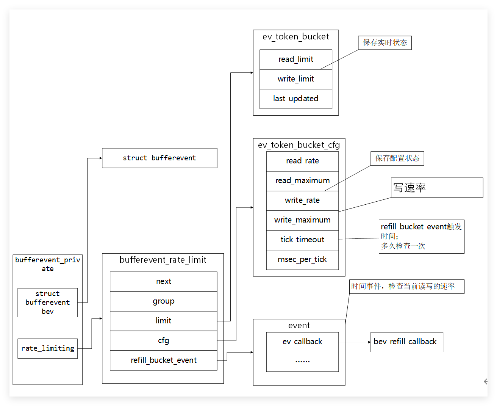
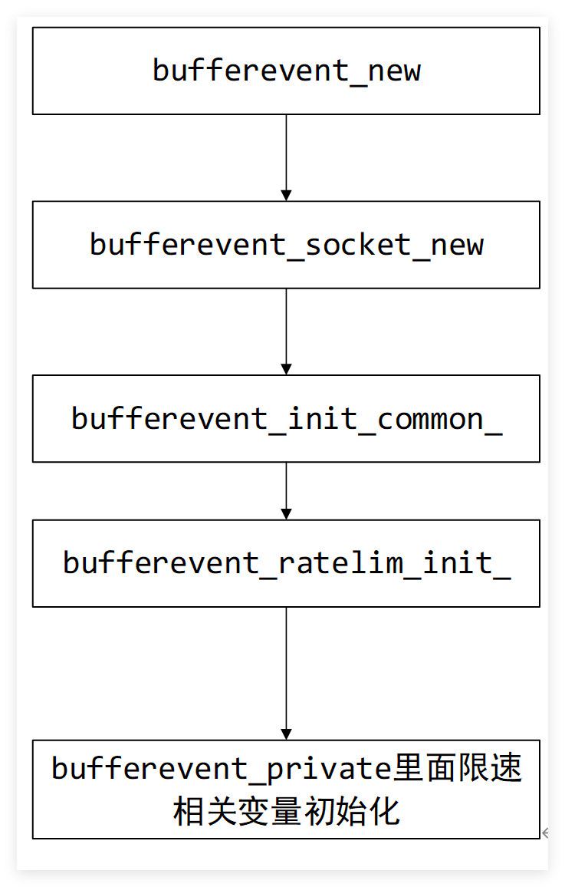
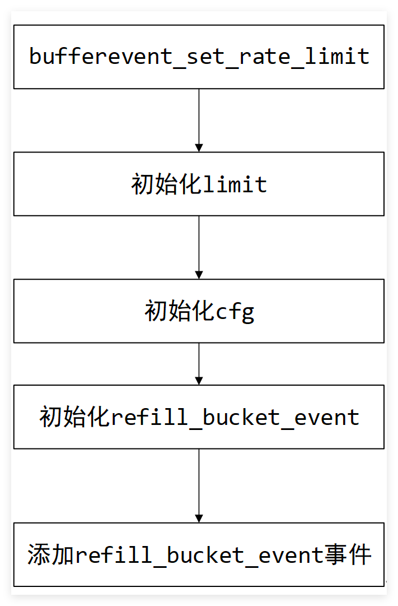
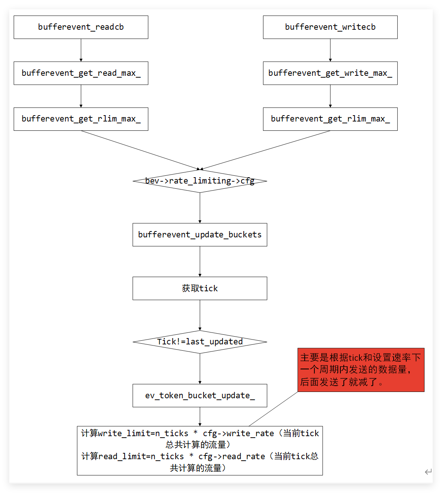
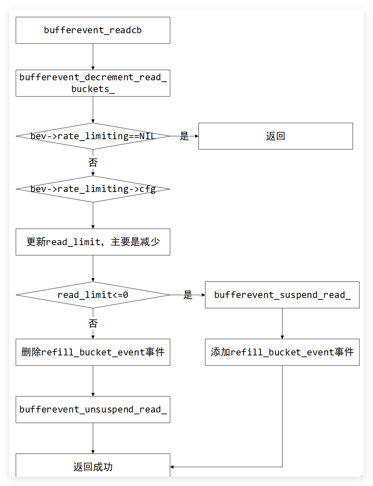
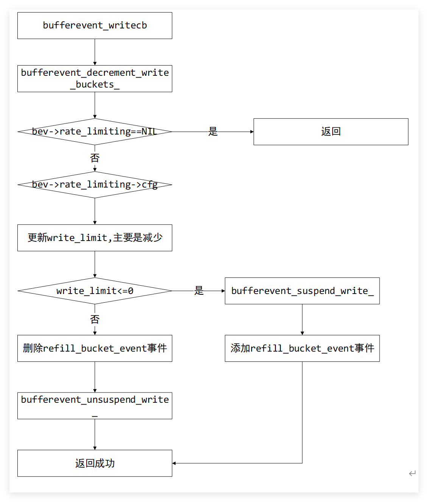

# 数据结构

write_maximum最大写速率；
msec_per_tick时间；
tick内最大写入数据量=write_maximum * msec_per_tick；
tick内最大读入数据量=read_maximum * msec_per_tick;

# 关键流程

## 初始化流程

## 用户设置流程

## 更新发送和接收数据的量

# 读速录限制

# 写速率限制

