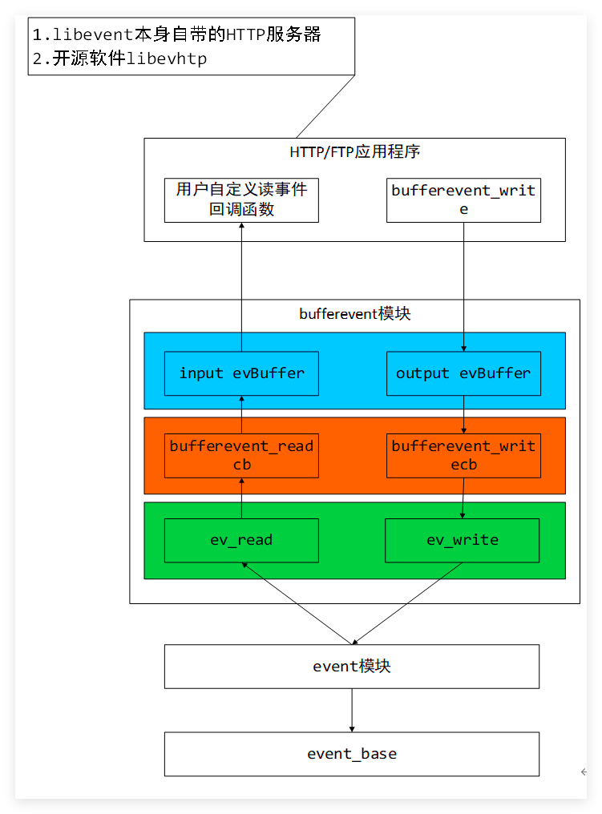
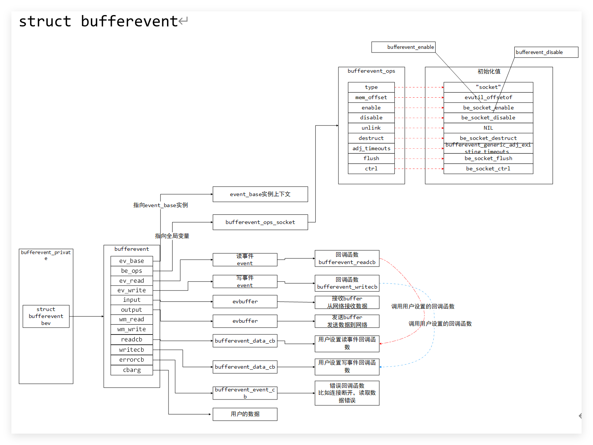
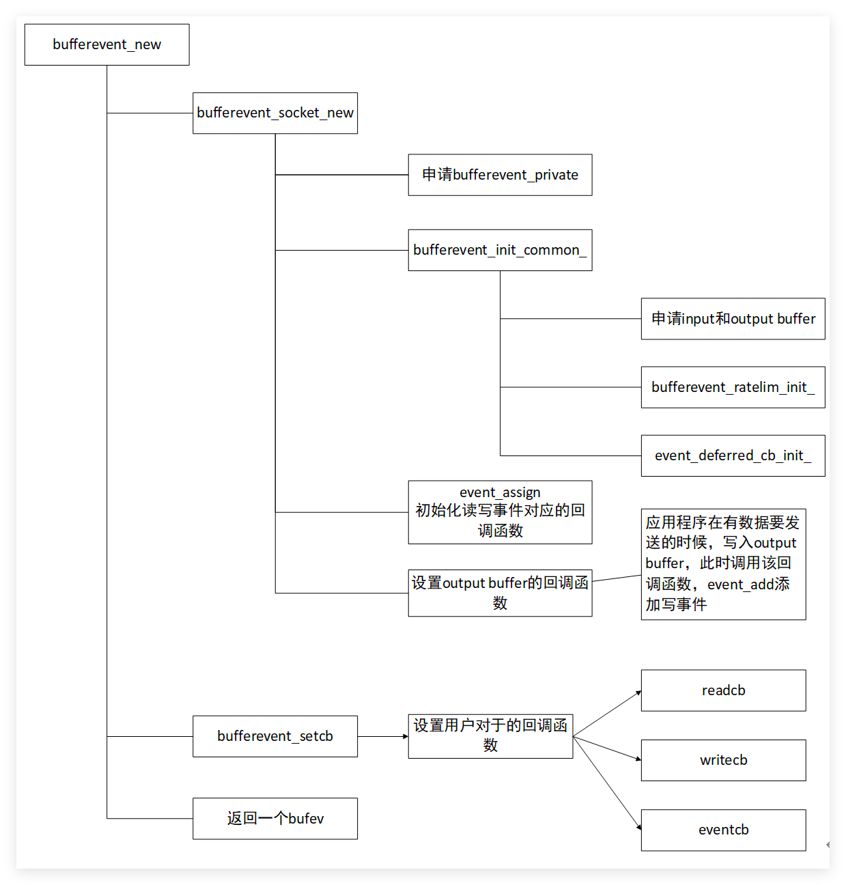
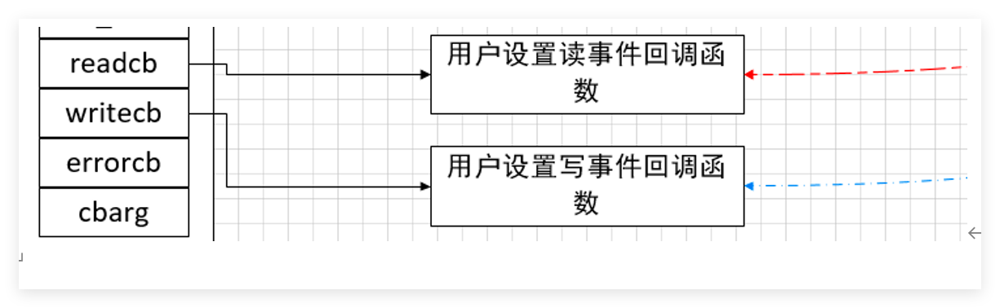
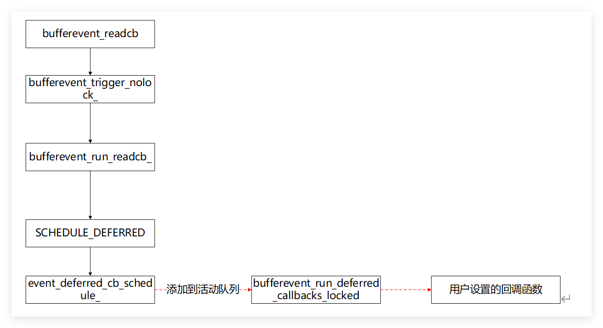
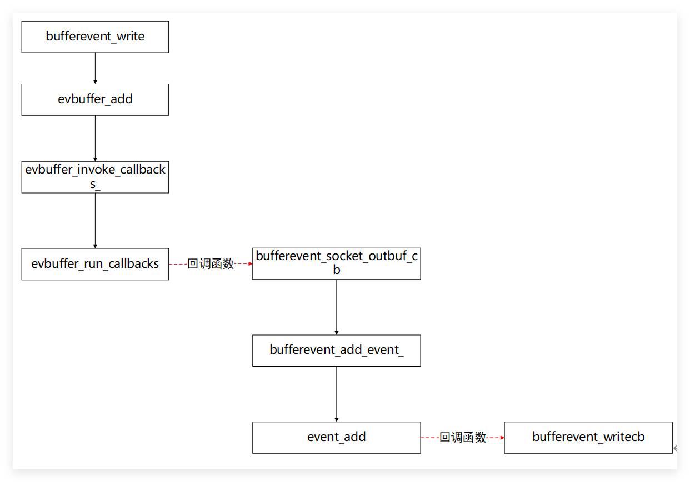

# bufferevent 相关数据结构

见: [Bufferevent and evbuffer](Bufferevent%20and%20evbuffer.md) [evbuffer](evbuffer.md)

比较重要的几个成员变量:

| 成员变量     | 类型                  | 含义                           |
| -------- | ------------------- | ---------------------------- |
| ev_base  | event_base          | 指向当前bufferevent属于的event_base |
| be_ops   | bufferevent_ops     | 操作类的函数指针                     |
| ev_read  | event               | 读事件                          |
| ev_write | event               | 写事件                          |
| input    | evbuffer            | 输入缓存，存储从套接字读出来的数据            |
| output   | evbuffer            | 输出缓存，需要从套接字发送出去的数据           |
| readcb   | bufferevent_data_cb | 读回调函数指针，传入的参数为cbarg          |
| writecb  | bufferevent_data_cb | 写回调函数指针, 传入的参数为cbarg         |
| errorcb  | bufferevent_data_cb | 出错回调函数指针, 传入的参数为cbarg        |

# bufferevent 初始化
其中设置outputevbuffer对应的回调函数bufferevent_socket_outbuf_cb，主要作用是在output evbuffer变化的时候，修改写事件

# bufferevent 设置读写回调函数

```c
void bufferevent_setcb(
	struct bufferevent *bufev, 
	bufferevent_data_cb readcb, 
	bufferevent_data_cb writecb,
	bufferevent_event_cb eventcb, 
	void *cbarg
)
```

主要是初始化bufferevent对应的三个回调函数


# 使能读写事件
|   |   |
|---|---|
|API接口|功能简述|
|bufferevent_disable|禁用读写事件|
|bufferevent_enable|使能读写事件|

# 用户湖读取数据

# 用户发送数据
bufferevent_write函数

主要调用`evbuffer_add-> bufferevent_socket_outbuf_cb->event_add`添加写事件，后面写事件触发调用。

事件触发首先会调用bufferevent_writecb函数，发送数据出去，然后调用用户设置的bufferevent对应的回调函数。