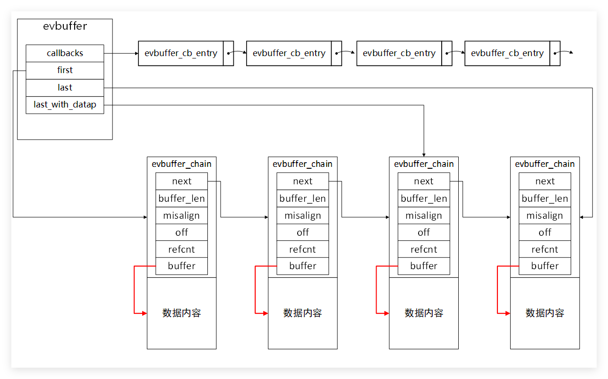
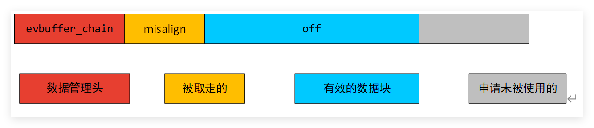

sturtc evbuffer: [evbuffer](evbuffer.md)] [libevent structure](libevent%20structure.md)
其中callbacks主要存储该evbuffer有数据变化的时候，对应的回调函数。

evbuffer主要通过evbuffer_chain的链表来管理和保存用户数据；

first和last指向evbuffer_chain链表的头节点和尾结点。

evbuffer_chain主要用来在内存中存储用户数据。

主要的结构如下

期望长度小于申请的长度为1024的2 N次方具体代码见函数evbuffer_chain_new。

# evbuffer 相关API简介

| 函数名             | 含义                                                         |
| ------------------ | ------------------------------------------------------------ |
| evbuffer_new       | 申请struct  evbuffer并且初始化                               |
| evbuffer_add       | 在evbuffer里面增加数据，并触发该buffer对应的回调函数         |
| evbuffer_remove    | 从evbuffer里面拷贝数据；拷贝成功，移除evbuffer相应的数据。   |
| evbuffer_write     | 把evbuffer的数据通过write函数发送到对应的fd；发送成功，移除成功的数据长度。 |
| evbuffer_read      | 从fd中读取相应的数据到evbuffer内存里面                       |
| evbuffer_add_cb    | 在evbuffer里面添加回调函数                                   |
| evbuffer_chain_new | 申请链表节点，用于管理数据块的使用                           |

 
