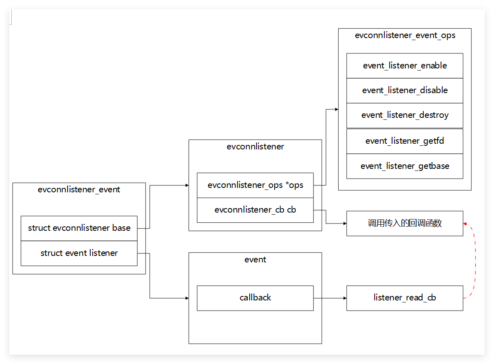

evconnlistener_event主要用于管理服务器的listen事件的上下文，其数据结构如下:
evconnlistener_new_bind函数原型如下:
```c
struct evconnlistener *
evconnlistener_new_bind(struct event_base *base, evconnlistener_cb cb,
    void *ptr, unsigned flags, int backlog, const struct sockaddr *sa,
    int socklen)
```

| 参数名  | 参数类型          | 含义                                    |
| ------- | ----------------- | --------------------------------------- |
| base    | event_base        | 保存event_base的地址                    |
| cb      | evconnlistener_cb | 新的TCP连接到来，accept后触发的回调函数 |
| ptr     | void *            | 回调函数需要的参数                      |
| flags   | unsigned          | 设置的标志                              |
| backlog | int               | listen函数调用设置的最大连接队列个数    |
| sa      | struct sockaddr   | 地址信息                                |
| socklen | int               | 地址长度                                |
创建服务器监听事件如下流程所示
