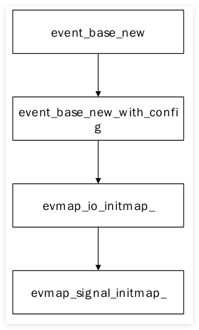

结构体见:[libevent_structure](libevent_structure.md)
关键的相关事件的处理接口函数和每种事件对应的数据都保存在此结构体中.


# event_base structure Initialization process 
初始化入口函数为event_base_new，下图展示了event_base_new函数主要调用流程.


关于对应`base->evsel`的相关实现为:
```c
/* Array of backends in order of preference. */
static const struct eventop *eventops[] = {
#ifdef EVENT__HAVE_EVENT_PORTS
	&evportops,
#endif
#ifdef EVENT__HAVE_WORKING_KQUEUE
	&kqops,
#endif
#ifdef EVENT__HAVE_EPOLL
	&epollops,
#endif
#ifdef EVENT__HAVE_DEVPOLL
	&devpollops,
#endif
#ifdef EVENT__HAVE_POLL
	&pollops,
#endif
#ifdef EVENT__HAVE_SELECT
	&selectops,
#endif
#ifdef _WIN32
	&win32ops,
#endif
#ifdef EVENT__HAVE_WEPOLL
	&wepollops,
#endif
	NULL
};
```

epoll后端初始化逻辑见:
[IO Initialization (evbase](IO%20Initialization%20(evbase.md)
## build default <font color="#f79646">event_base</font>

==event_base_new()==函数分配并且返回一个新的具有默认设置的<font color="#f79646">event_base</font>。函数会检测环境变量，返回一个到event_base的指针。如果发生错误，则返回NULL。选择各种方法时，函数会选择OS支持的最快方法。 

### <font color="#4bacc6">event_base_new(void)</font>

<font color="#4bacc6">event_base_new()</font>函数声明在`<event2/event.h>`中

```c++
struct event_base * event_base_new(void)
{
	struct event_base *base = NULL;
    //配置config 创建一个默认的event_config
	struct event_config *cfg = event_config_new();
	if (cfg) {
		base = event_base_new_with_config(cfg);
		event_config_free(cfg);
	}
	return base;
}
```

## build complex <font color="#f79646">event_base</font>

要对取得什么类型的event_base有更多的控制，就需要使用event_config。event_config是一个容纳event_base配置信息的不透明结构体。需要event_base时，将event_config传递给event_base_new_with_config().

这些函数和类型在<event2/event.h>中声明。
以下代码相关宏函数见：[Macro definition](Macro%20definition.md)

### <font color="#4bacc6">event_config_new()</font>

```c++
#define INT_MAX __INT_MAX__

/**在 C/C++ 中用于表示 int 类型所能表示的最大值。它是一个编译器常量，值为 2147483647(0x7ffffffff)*/ 

struct event_config * event_config_new(void)
{
	struct event_config *cfg = mm_calloc(1, sizeof(*cfg));

	if (cfg == NULL)
		return (NULL);

	TAILQ_INIT(&cfg->entries); 
	cfg->max_dispatch_interval.tv_sec = -1;
	cfg->max_dispatch_callbacks = INT_MAX;
	cfg->limit_callbacks_after_prio = 1;

	return (cfg);
}

```
<font color="#8064a2">TAILQ_INIT</font> 相关定义： [Macro function](Macro%20function.md)

 要使用这些函数分配<font color="#4bacc6">event_base</font>，先调用`event_config_new()`分配一个`event_config`。然后,对`event_config`调用其它函数，设置所需要的`event_base`特征。最后，调用其它函数，设置所需要的`event_base`特征。最后，调用`event_base_new_with_config()`获取新的`event_base`。完成工作后，使用`event_config_free()`释放`event_config`。

### <font color="#4bacc6">event_base_new_with_config</font>
这个函数在event_base_new被调用，传入的参数是event_config，根据cfg的内容来配置event_base

```c++
struct event_base * event_base_new_with_config(const struct event_config *cfg)
{
	int i;
	struct event_base *base;
	int should_check_environment;

#ifndef EVENT__DISABLE_DEBUG_MODE
		// 如果未禁用调试模式，设置一个标志表示已经太晚启用调试模式
		event_debug_mode_too_late = 1;
#endif
		// 安全分配内存用于存储 event_base 结构体，并初始化为 0
	if ((base = mm_calloc(1, sizeof(struct event_base))) == NULL) { //安全分配内存
		// 如果内存分配失败，打印警告信息并返回 NULL
		event_warn("%s: calloc", __func__);
		return NULL;
	}
	// 如果传入了配置结构体，设置 base 的标志
	if (cfg)
		base->flags = cfg->flags;

	// 确定是否需要检查环境变量
	should_check_environment =
	    !(cfg && (cfg->flags & EVENT_BASE_FLAG_IGNORE_ENV));

	{
		// 检查是否需要精确时间
		struct timeval tmp;
		int precise_time =
		    cfg && (cfg->flags & EVENT_BASE_FLAG_PRECISE_TIMER);
		int flags;
		if (should_check_environment && !precise_time) {
			// 如果环境变量中设置了精确计时器标志，则启用精确时间
			precise_time = evutil_getenv_("EVENT_PRECISE_TIMER") != NULL;
			if (precise_time) {
				base->flags |= EVENT_BASE_FLAG_PRECISE_TIMER;
			}
		}
		// 配置单调计时器
		flags = precise_time ? EV_MONOT_PRECISE : 0;
		evutil_configure_monotonic_time_(&base->monotonic_timer, flags);
		// 获取当前时间
		gettime(base, &tmp);
	}
	// 初始化最小堆，用于管理定时事件
	min_heap_ctor_(&base->timeheap);

	// 初始化信号处理相关的文件描述符为 -1，表示未使用
	base->sig.ev_signal_pair[0] = -1;
	base->sig.ev_signal_pair[1] = -1;
	base->th_notify_fd[0] = -1;
	base->th_notify_fd[1] = -1;

	// 初始化用于延迟激活事件的队列
	TAILQ_INIT(&base->active_later_queue);

	// 初始化 IO 映射和信号映射，用于管理 IO 和信号事件
	evmap_io_initmap_(&base->io);
	evmap_signal_initmap_(&base->sigmap);

	// 初始化事件更改列表，用于记录事件状态的更改
	event_changelist_init_(&base->changelist);

	base->evbase = NULL;

	// 如果有传入的配置，则复制最大调度时间和优先级限制
	if (cfg) {
		memcpy(&base->max_dispatch_time,
		    &cfg->max_dispatch_interval, sizeof(struct timeval));
		base->limit_callbacks_after_prio =
		    cfg->limit_callbacks_after_prio;
	} else {
		// 如果没有配置，使用默认值
		base->max_dispatch_time.tv_sec = -1;
		base->limit_callbacks_after_prio = 1;
	}
	if (cfg && cfg->max_dispatch_callbacks >= 0) {
		base->max_dispatch_callbacks = cfg->max_dispatch_callbacks;
	} else {
		base->max_dispatch_callbacks = INT_MAX;
	}
		// 如果没有调度时间限制和回调限制，设置为最大优先级限制
	if (base->max_dispatch_callbacks == INT_MAX &&
	    base->max_dispatch_time.tv_sec == -1)
		base->limit_callbacks_after_prio = INT_MAX;
	// 遍历所有可用的事件操作方法，选择一个适合的事件后端
	for (i = 0; eventops[i] && !base->evbase; i++) {
		if (cfg != NULL) {
			// 如果配置中避免了某些方法，跳过这些方法
			/* determine if this backend should be avoided */
			if (event_config_is_avoided_method(cfg,
				eventops[i]->name))
				continue;
			// 如果方法不满足所需的特性，跳过该方法
			if ((eventops[i]->features & cfg->require_features)
			    != cfg->require_features)
				continue;
		}
		// 检查环境变量中是否禁用了该方法
		/* also obey the environment variables */
		if (should_check_environment &&
		    event_is_method_disabled(eventops[i]->name))
			continue;
		// 所谓后端就是epoll poll select等
		// 选择该方法作为事件后端
		base->evsel = eventops[i];
		// 初始化该事件后端
		base->evbase = base->evsel->init(base);
	}
	// 如果没有可用的事件后端，释放资源并返回 NULL
	if (base->evbase == NULL) {
		event_warnx("%s: no event mechanism available",
		    __func__);
		base->evsel = NULL;
		event_base_free(base);
		return NULL;
	}
	// 如果设置了环境变量，显示所使用的事件后端方法
	if (evutil_getenv_("EVENT_SHOW_METHOD"))
		event_msgx("libevent using: %s", base->evsel->name);
	// 为事件基分配一个单独的激活事件队列
	 
	if (event_base_priority_init(base, 1) < 0) {
		event_base_free(base);
		return NULL;
	}

	 
	// 准备线程支持
#if !defined(EVENT__DISABLE_THREAD_SUPPORT) && !defined(EVENT__DISABLE_DEBUG_MODE)
	event_debug_created_threadable_ctx_ = 1;
#endif

#ifndef EVENT__DISABLE_THREAD_SUPPORT
	// 如果启用了线程锁定，并且配置中未禁用锁定
	if (EVTHREAD_LOCKING_ENABLED() &&
	    (!cfg || !(cfg->flags & EVENT_BASE_FLAG_NOLOCK))) {
		int r;
		// 分配锁和条件变量
		EVTHREAD_ALLOC_LOCK(base->th_base_lock, 0);
		EVTHREAD_ALLOC_COND(base->current_event_cond);
		// 使事件基可被通知
		r = evthread_make_base_notifiable(base);
		if (r<0) {
			event_warnx("%s: Unable to make base notifiable.", __func__);
			event_base_free(base);
			return NULL;
		}
	}
#endif

#ifdef _WIN32
	// 如果在 Windows 系统上并且配置要求启动 IOCP，启动 IOCP
	if (cfg && (cfg->flags & EVENT_BASE_FLAG_STARTUP_IOCP))
		event_base_start_iocp_(base, cfg->n_cpus_hint);
#endif
	// 返回初始化好的 event_base 对象
	return (base);
}


```
 全局变量

~~~c

/* Array of backends in order of preference. */
static const struct eventop *eventops[] = {
#ifdef EVENT__HAVE_EVENT_PORTS
	&evportops,
#endif
#ifdef EVENT__HAVE_WORKING_KQUEUE
	&kqops,
#endif
#ifdef EVENT__HAVE_EPOLL
	&epollops,
#endif
#ifdef EVENT__HAVE_DEVPOLL
	&devpollops,
#endif
#ifdef EVENT__HAVE_POLL
	&pollops,
#endif
#ifdef EVENT__HAVE_SELECT
	&selectops,
#endif
#ifdef _WIN32
	&win32ops,
#endif
#ifdef EVENT__HAVE_WEPOLL
	&wepollops,
#endif
	NULL
};

~~~

~~~c
const struct eventop epollops = {
	"epoll",
	epoll_init,
	epoll_nochangelist_add,
	epoll_nochangelist_del,
	epoll_dispatch,
	epoll_dealloc,//释放初始化释放的资源
	1, /* need reinit */
	EV_FEATURE_ET|EV_FEATURE_O1|EV_FEATURE_EARLY_CLOSE,
	0
};
~~~


- **内存分配和初始化**：首先，函数通过 `mm_calloc` 安全地分配内存，并将其初始化为零。然后根据传入的配置 `cfg` 设置 `event_base` 结构体中的一些标志和参数。
    
- **时间和计时器配置**：函数检查是否需要启用精确的计时器，配置单调计时器，并获取当前时间以供后续操作。
    
- **数据结构初始化**：初始化了用于管理事件的各种数据结构，例如最小堆、信号处理、IO 映射、信号映射等。
    
- **选择事件后端**：函数遍历可用的事件操作方法（如 epoll、kqueue 等），选择一个合适的作为事件后端，并通过初始化函数进行配置。
    
- **线程支持**：如果启用了线程支持，则分配必要的锁和条件变量，并确保事件基可以在多线程环境下正常工作。
    
- **平台特定操作**：在 Windows 系统上，如果配置要求启用 IOCP，则会启动相应的机制。
    
- **错误处理**：在初始化过程中，如果出现任何错误，函数会释放已经分配的资源并返回 `NULL`，以防止内存泄漏或其他未定义行为。

最后，函数返回一个完全初始化好的 `event_base` 结构体，用于后续的事件管理。


### <font color="#4bacc6">event_config_free()</font>
```cpp
//用来释放config
void event_config_free(struct event_config *cfg)
{
	struct event_config_entry *entry;

	while ((entry = TAILQ_FIRST(&cfg->entries)) != NULL) {
		TAILQ_REMOVE(&cfg->entries, entry, next);
		event_config_entry_free(entry);
	}
	mm_free(cfg);
}
```


### <font color="#4bacc6">event_config_avoid_method()</font>

```cpp
int event_config_avoid_method(struct event_config *cfg, const char *method)
{
	struct event_config_entry *entry = mm_malloc(sizeof(*entry));
	if (entry == NULL)
		return (-1);

	if ((entry->avoid_method = mm_strdup(method)) == NULL) {
		mm_free(entry);
		return (-1);
	}

	TAILQ_INSERT_TAIL(&cfg->entries, entry, next);

	return (0);
}
```
调用<font color="#4bacc6">event_config_avoid_method()</font>可以通过名字让libevent避免使用特定的可用后端。
调用<font color="#4bacc6">event_config_require_feature()</font>让libevent不使用不能提供所有指定特征的后端
调用<font color="#4bacc6">调用event_config_set_flag()</font>让libevent在创建`event_base`时设置一个或者多个将在下面介绍的运行时标志。
### <font color="#4bacc6">event_config_require_feature()</font>
```c
int event_config_require_features(struct event_config *cfg,int features)
{
	if (!cfg)
		return (-1);
	cfg->require_features = features;
	return (0);
}
```

 相关支持的宏

| <font color="#8064a2">EV_FEATURE_ET</font> | 要求支持边沿触发的后端                            |
| ------------------------------------------ | -------------------------------------- |
| <font color="#8064a2">EV_FEATURE_ET</font> | 要求添加、删除单个事件，或者确定哪个事件激活的操作是O（1）复杂度后   端 |
| <font color="#8064a2">EV_FEATURE_ET</font>                              | 要求支持任意文件描述符，而不仅仅是套接字的后端                |

### <font color="#4bacc6">event_config_set_flag</font>
```c
int event_config_set_flag(struct event_config *cfg, int flag)
{
	if (!cfg)
		return -1;
	cfg->flags |= flag;
	return 0;
}
```
## event_base_config_flag
~~~c
enum event_base_config_flag {
    /** 不为事件基础结构分配锁，即使我们已经设置了锁机制。
        设置此选项将使得从多个线程并发调用事件基础结构中的函数变得不安全且无法正常工作。
    */
    EVENT_BASE_FLAG_NOLOCK = 0x01,

    /** 在配置事件基础结构时，不检查 EVENT_* 环境变量 */
    EVENT_BASE_FLAG_IGNORE_ENV = 0x02,

    /** 仅适用于 Windows：启动时启用 IOCP 调度器
        如果设置此标志，`bufferevent_socket_new()` 和 `evconn_listener_new()` 将使用 IOCP 实现，
        而不是 Windows 上通常使用的基于 select 的实现。

        注意：这是一个实验性特性，可能存在一些 bug。
    */
    EVENT_BASE_FLAG_STARTUP_IOCP = 0x04,

    /** 在事件循环准备运行超时回调时，检查当前时间。  
        设置此标志后，检查时间将发生在每个超时回调之后，而不是每次准备运行超时回调时。
    */
    EVENT_BASE_FLAG_NO_CACHE_TIME = 0x08,

    /** 如果使用 epoll 后端，该标志表示可以安全地使用 Libevent 的内部变更列表代码来批量添加和删除事件，
        从而尽量减少系统调用的次数。设置此标志可以提高代码运行速度，但如果有任何文件描述符被 `dup()` 或其变体克隆，
        可能会触发 Linux bug，导致难以诊断的问题。

        如果最终使用的是其他后端，该标志将不起作用。
    */
    EVENT_BASE_FLAG_EPOLL_USE_CHANGELIST = 0x10,

    /** 通常，Libevent 使用最快的单调时钟来实现时间和超时的处理。但如果设置此标志，
        我们将使用一个效率较低但更精确的定时器（假设系统有此定时器）。
    */
    EVENT_BASE_FLAG_PRECISE_TIMER = 0x20,

    /** 如果启用了 `EVENT_BASE_FLAG_PRECISE_TIMER`，则 epoll 后端将使用 `timerfd` 来获得更精确的定时器。
        此标志允许禁用此功能。

        这意味着该设置在没有启用 `EVENT_BASE_FLAG_PRECISE_TIMER` 的情况下类似于缺少精确定时器（CLOCK_MONOTONIC_COARSE），
        启用时则使用 `CLOCK_MONOTONIC` + `timerfd` 来实现更精确的定时。
        如果使用的是非 epoll 后端或者没有启用 `EVENT_BASE_FLAG_PRECISE_TIMER`，则此标志无效。
    */
    EVENT_BASE_FLAG_EPOLL_DISALLOW_TIMERFD = 0x40,

    /** 使用 `signalfd(2)` 来处理信号，而不是使用 `sigaction` 或 `signal`。
        需要注意的是，在某些极端情况下，`signalfd()` 的工作方式可能与传统的信号处理机制有所不同。
    */
    EVENT_BASE_FLAG_USE_SIGNALFD = 0x80,
};

~~~

| <font color="#8064a2">EVENT_BASE_FLAG_NOLOCK</font>               | 不要为<font color="#4bacc6">event_base</font>分配锁。设置这个选项可以为<font color="#4bacc6">event_bas</font>e节省一点用于锁定和解锁的时间，但是让在多个线程中访<font color="#4bacc6">event_base</font>成为不安全的。                                                                                                                                                                     |
| ----------------------------------------------------------------- | ----------------------------------------------------------------------------------------------------------------------------------------------------------------------------------------------------------------------------------------------------------------------------------------------------------------------------------------- |
| <font color="#8064a2">EVENT_BASE_FLAG_EPOLL_USE_CHANGELIST</font> | 告诉libevent，如果决定使用epoll后端，可以安全地使用更快的基于changelist的后端。epoll-changelist后端可以在后端的分发函数调用之间，同样的fd多次修改其状态的情况下，避免不必要的系统调用。但是如果传递任何使用dup（）或者其变体克隆的fd给libevent，epoll-changelist后端会触发一个内核bug，导致不正确的结果。在不使用epoll后端的情况下，这个标志是没有效果的。也可以通过设置<font color="#8064a2">EVENT_EPOLL_USE_CHANGELIST</font>环境变量来打开<font color="#4bacc6">epoll-changelis</font>t选项。 |
| <font color="#8064a2">EVENT_BASE_FLAG_IGNORE_ENV</font>           | 选择使用的后端时，不要检测<font color="#00b050">EVENT_*</font>环境变量。使用这个标志需要三思：这会让用户更难调试你的程序与libevent的交互。                                                                                                                                                                                                                                               |
| <font color="#8064a2">EVENT_BASE_FLAG_NO_CACHE_TIME</font>        | 不是在事件循环每次准备执行超时回调时检测当前时间，而是在每次超时回调后进行检测。注意：这会消耗更多的CPU时间。                                                                                                                                                                                                                                                                                  |
| <font color="#8064a2">EVENT_BASE_FLAG_STARTUP_IOCP</font>         | 仅用于Windows，让libevent在启动时就启用任何必需的IOCP分发逻辑，而不是按需启用。                                                                                                                                                                                                                                                                                         |
上述操作event_config的函数都在成功时返回0，失败时返回-1。

**==注意==**

设置event_config，请求OS不能提供的后端是很容易的。比如说，对于<font color="#00b050">libevent 2.0.1-alpha</font>，在Windows中是没有O（1）后端的；在Linux中也没有同时提供<font color="#8064a2">EV_FEATURE_FDS</font>和<font color="#8064a2">EV_FEATURE_O1</font>特征的后端。如果创建了libevent不能满足的配置，event_base_new_with_config（）会返回<font color="#8064a2">NULL</font>。

### <font color="#4bacc6">event_config_set_num_cpus_hint()</font>
```c
int event_config_set_num_cpus_hint(struct event_config *cfg, int cpus)
{
	if (!cfg)
		return (-1);
	cfg->n_cpus_hint = cpus;
	return (0);
}
```
这个函数当前仅在Windows上使用IOCP时有用，虽然将来可能在其他平台上有用。这个函数告诉event_config在生成多线程event_base的时候，应该试图使用给定数目的CPU。注意这仅仅是一个提示：<font color="#4bacc6">event_base</font>使用的CPU可能比你选择的要少。

<font color="#8064a2">EVENT_BASE_FLAG_IGNORE_ENV</font>标志首次出现在2.0.2-alpha版本<font color="#4bacc6">event_config_set_num_cpus_hint()</font>函数是2.0.7-rc版本新引入的。检查`event_base`的后端方法'


### <font color="#4bacc6">event_get_supported_methods()</font>
```c

const char ** event_get_supported_methods(void)
{
	static const char **methods = NULL;
	const struct eventop **method;
	const char **tmp;
	int i = 0, k;

	/* count all methods */
	for (method = &eventops[0]; *method != NULL; ++method) {
		++i;
	}

	/* allocate one more than we need for the NULL pointer */
	tmp = mm_calloc((i + 1), sizeof(char *));
	if (tmp == NULL)
		return (NULL);

	/* populate the array with the supported methods */
	for (k = 0, i = 0; eventops[k] != NULL; ++k) {
		tmp[i++] = eventops[k]->name;
	}
	tmp[i] = NULL;

	if (methods != NULL)
		mm_free((char**)methods);

	methods = tmp;

	return (methods);
}
```
<font color="#4bacc6">event_get_supported_methods()</font>函数返回一个指针，指向libevent支持的方法名字数组。这个数组的最后一个元素是NULL。

**<font color="#ffff00">注意</font>**

这个函数返回libevent被编译以支持的方法列表。然而libevent运行的时候，操作系统可能不能支持所有方法。比如说，可能OS X版本中的kqueue的bug太多，无法使用。

### <font color="#4bacc6">event_base_get_method()</font>

```c
const char * event_base_get_method(const struct event_base *base)
{
	EVUTIL_ASSERT(base);//检查给定的条件 cond 是否满足
	return (base->evsel->name);
}
```
<font color="#8064a2">EVUTIL_ASSERT</font> 见：[[Macro function]]

## free <font color="#4bacc6">event_base</font>
使用完 <font color="#4bacc6">event_base</font> 之后，使用<font color="#4f81bd">event_base_free()</font>进行释放

### <font color="#4bacc6">event_base_free()</font>
```c
void event_base_free(struct event_base *base)
{
	event_base_free_(base, 1);
}

```

参数 `base` 是指向需要释放的 `event_base` 结构的指针，`run_finalizers` 是一个标志，用于指示是否需要运行终结器。
```c

static void
event_base_free_(struct event_base *base, int run_finalizers)
{
	int i, n_deleted=0;
	struct event *ev;
	/* XXXX grab the lock? If there is contention when one thread frees
	 * the base, then the contending thread will be very sad soon. */
	/* 这段注释表明，在一个线程释放资源（通常指的是一个共享的基础对象或结构）时，可能需要获取一个锁（lock）来防止其他线程同时	访问该资源。如果不加锁，而另一个线程尝试访问同一个资源，就会发生竞争（contention）。竞争会导致程序不正确的行为，甚至崩	溃。*/
    
    
	/* event_base_free(NULL) is how to free the current_base if we
	 * made it with event_init and forgot to hold a reference to it. */
   	/*这段注释解释了如何释放当前的基础对象。如果您使用 event_init 函数创建了一个基础对象，但忘记了保存对它的引用，那么可以通		过调用 event_base_free(NULL) 来释放它。这表明 event_base_free 函数允许一个 NULL 参数，这种情况下，它将释放当前	   上下文中的基础对象。*/
	if (base == NULL && current_base)
		base = current_base;
	/* Don't actually free NULL. */
	if (base == NULL) {
		event_warnx("%s: no base to free", __func__);
		return;
	}
	/* XXX(niels) - check for internal events first */

#ifdef _WIN32
	event_base_stop_iocp_(base);
#endif

	/* threading fds if we have them */
	if (base->th_notify_fd[0] != -1) {
		event_del(&base->th_notify);
		EVUTIL_CLOSESOCKET(base->th_notify_fd[0]);
		if (base->th_notify_fd[1] != -1)
			EVUTIL_CLOSESOCKET(base->th_notify_fd[1]);
		base->th_notify_fd[0] = -1;
		base->th_notify_fd[1] = -1;
		event_debug_unassign(&base->th_notify);
	}

	/* Delete all non-internal events. */
	evmap_delete_all_(base);

	while ((ev = min_heap_top_(&base->timeheap)) != NULL) {
		event_del(ev);
		++n_deleted;
	}
	for (i = 0; i < base->n_common_timeouts; ++i) {
		struct common_timeout_list *ctl =
		    base->common_timeout_queues[i];
		event_del(&ctl->timeout_event); /* Internal; doesn't count */
		event_debug_unassign(&ctl->timeout_event);
		for (ev = TAILQ_FIRST(&ctl->events); ev; ) {
			struct event *next = TAILQ_NEXT(ev,
			    ev_timeout_pos.ev_next_with_common_timeout);
			if (!(ev->ev_flags & EVLIST_INTERNAL)) {
				event_del(ev);
				++n_deleted;
			}
			ev = next;
		}
		mm_free(ctl);
	}
	if (base->common_timeout_queues)
		mm_free(base->common_timeout_queues);

	for (;;) {
		/* For finalizers we can register yet another finalizer out from
		 * finalizer, and iff finalizer will be in active_later_queue we can
		 * add finalizer to activequeues, and we will have events in
		 * activequeues after this function returns, which is not what we want
		 * (we even have an assertion for this).
		 *
		 * A simple case is bufferevent with underlying (i.e. filters).
		 */
		int i = event_base_free_queues_(base, run_finalizers);
		event_debug(("%s: %d events freed", __func__, i));
		if (!i) {
			break;
		}
		n_deleted += i;
	}

	if (n_deleted)
		event_debug(("%s: %d events were still set in base",
			__func__, n_deleted));

	while (LIST_FIRST(&base->once_events)) {
		struct event_once *eonce = LIST_FIRST(&base->once_events);
		LIST_REMOVE(eonce, next_once);
		mm_free(eonce);
	}

	if (base->evsel != NULL && base->evsel->dealloc != NULL)
		base->evsel->dealloc(base);

	for (i = 0; i < base->nactivequeues; ++i)
		EVUTIL_ASSERT(TAILQ_EMPTY(&base->activequeues[i]));

	EVUTIL_ASSERT(min_heap_empty_(&base->timeheap));
	min_heap_dtor_(&base->timeheap);

	mm_free(base->activequeues);

	evmap_io_clear_(&base->io);
	evmap_signal_clear_(&base->sigmap);
	event_changelist_freemem_(&base->changelist);

	EVTHREAD_FREE_LOCK(base->th_base_lock, 0);
	EVTHREAD_FREE_COND(base->current_event_cond);

	/* If we're freeing current_base, there won't be a current_base. */
	if (base == current_base)
		current_base = NULL;
	mm_free(base);
}

```

#### notes
```c
/* Global state; deprecated */
//全局的event_base current_base(event_global_current_base)
EVENT2_EXPORT_SYMBOL
struct event_base *event_global_current_base_ = NULL;
#define current_base event_global_current_base_

```
1. **处理 `NULL` 基础对象**： 如果 `base` 是 `NULL` 并且 `current_base` 存在，那么将 `base` 设置为 `current_base`。
    
```c
    if (base == NULL && current_base)  
        base = current_base;d  
    if (base == NULL) {  
        event_warnx("%s: no base to free", __func__);  
        return;  
    }
```
    
2. **停止 Windows 特定的 IOCP 处理**（仅在 Windows 平台上有效）：
    
```c
    #ifdef _WIN32  
    event_base_stop_iocp_(base);//此处不做讨论  
    #endif
```
    
3. **处理线程通知文件描述符**： 删除线程通知事件并关闭文件描述符。
    
  
```c
  if (base->th_notify_fd[0] != -1) {  
	event_del(&base->th_notify);  
	EVUTIL_CLOSESOCKET(base->th_notify_fd[0]);  
	if (base->th_notify_fd[1] != -1)  
		EVUTIL_CLOSESOCKET(base->th_notify_fd[1]);  
	base->th_notify_fd[0] = -1;  
	base->th_notify_fd[1] = -1;  
	event_debug_unassign(&base->th_notify);  
}
```
4. **删除所有非内部事件**： 删除时间堆中的所有事件，并释放公共超时队列中的事件。
```c
    evmap_delete_all_(base);  
    while ((ev = min_heap_top_(&base->timeheap)) != NULL) {  
        event_del(ev);  
        ++n_deleted;  
    }  
    for (i = 0; i < base->n_common_timeouts; ++i) {  
        struct common_timeout_list *ctl = base->common_timeout_queues[i];  
        event_del(&ctl->timeout_event); // Internal; doesn't count  
        event_debug_unassign(&ctl->timeout_event);  
        for (ev = TAILQ_FIRST(&ctl->events); ev; ) {  
			struct event *next = TAILQ_NEXT(ev,                                                           ev_timeout_pos.ev_next_with_common_timeout);  
            if (!(ev->ev_flags & EVLIST_INTERNAL)) {  
                event_del(ev);  
                ++n_deleted;  
            }  
            ev = next;  
        }  
        mm_free(ctl);  
    }  
    if (base->common_timeout_queues)  
        mm_free(base->common_timeout_queues);
```
    
    
5. **释放一次性事件**： 释放 `once_events` 列表中的事件。
    
```c
    while (LIST_FIRST(&base->once_events)) {  
        struct event_once *eonce = LIST_FIRST(&base->once_events);  
        LIST_REMOVE(eonce, next_once);  
        mm_free(eonce);  
    }
    
```
6. **释放选择器和锁**： 释放事件选择器和相关的锁与条件变量。
```c++
    if (base->evsel != NULL && base->evsel->dealloc != NULL)  
        base->evsel->dealloc(base);  
    ​  
    for (i = 0; i < base->nactivequeues; ++i)  
        EVUTIL_ASSERT(TAILQ_EMPTY(&base->activequeues[i]));  
    ​  
    EVUTIL_ASSERT(min_heap_empty_(&base->timeheap));  
    min_heap_dtor_(&base->timeheap);  
    ​  
    mm_free(base->activequeues);  
    ​  
    evmap_io_clear_(&base->io);  
    evmap_signal_clear_(&base->sigmap);  
    event_changelist_freemem_(&base->changelist);  
    ​  
    EVTHREAD_FREE_LOCK(base->th_base_lock, 0);  
    EVTHREAD_FREE_COND(base->current_event_cond);
```
  
7. **释放基础对象**： 如果正在释放 `current_base`，则将其设置为 `NULL`，并最终释放 `base`。
```c
    
    if (base == current_base)  
        current_base = NULL;  
    mm_free(base);
    
```

 这个函数通过清理和释放所有相关资源和内存来销毁一个 `event_base` 对象。注释中提到的竞争条件提醒开发者在多线程环境中小心处理共享资源，确保程序的稳定性和正确性。

## set <font color="#4bacc6">event_base</font> 's priority
libevent支持为事件设置多个优先级。然而，event_base默认只支持单个优先级。可以调用 <font color="#4bacc6">event_base_priority_init（</font>）设置event_base的优先级数目
```c
int event_base_priority_init(struct event_base *base, int npriorities)
```
成功时这个函数返回0，失败时返回-1。base是要修改的 <font color="#4bacc6">event_base</font>，n_priorities是要支持的优先级数目，这个数目至少是1。每个新的事件可用的优先级将从0（最高）到n_priorities-1（最低）。

常量<font color="#8064a2">EVENT_MAX_PRIORITIES</font>表示<font color="#00b050">n_priorities</font>的上限。调用这个函数时为 <font color="#00b050">n_priorities</font> 给出更大的值是错误的。

🔔
	 必须在任何事件激活之前调用这个函数，最好在创建event_base后立刻调用。
默认情况下，与event_base相关联的事件将被初始化为具有优先级<font color="#00b050">n_priorities / 2</font>。<font color="#4bacc6">event_base_priority_init（）</font>函数定义在<event2/event.h>中，从libevent 1.0版就可用了。

这个宏用于获取`event_base`_的锁（if support）
<font color="#8064a2">EVBASE_ACQUIRE_LOCK</font> 见:[[Macro function]]

### <font color="#4bacc6"> event_base_priority_init()</font>

```c

int event_base_priority_init(struct event_base *base, int npriorities)
{
	int i, r;
	r = -1; //用于指示返回值的状态	
	//在多线程环境中，需要获取锁以确保对 base 的修改是线程安全的。
	EVBASE_ACQUIRE_LOCK(base, th_base_lock);
    //展开类似 EVLOCK_LOCK((base)->th_base_lock, 0);

	//参数和状态检查
	if (N_ACTIVE_CALLBACKS(base) || npriorities < 1
	    || npriorities >= EVENT_MAX_PRIORITIES)
		goto err;
	//检查是否需要重新分配队列	
	if (npriorities == base->nactivequeues)
		goto ok;
	
	if (base->nactivequeues) {
		mm_free(base->activequeues);
		base->nactivequeues = 0;
	}

	/* Allocate our priority queues */
    //分配新的优先级队列
	base->activequeues = (struct evcallback_list *)
	  mm_calloc(npriorities, sizeof(struct evcallback_list));
	if (base->activequeues == NULL) {
		event_warn("%s: calloc", __func__);
		goto err;
	}
	base->nactivequeues = npriorities;

	for (i = 0; i < base->nactivequeues; ++i) {
		TAILQ_INIT(&base->activequeues[i]);
	}

ok:
	r = 0;
err:
	EVBASE_RELEASE_LOCK(base, th_base_lock);
	return (r);
}
```

> 这个函数的主要目的是为事件基础结构 `base` 初始化或重新初始化优先级队列。它通过以下步骤实现：

1. 获取锁以确保线程安全。
    
2. 检查输入参数和当前状态。
    
3. 如果需要，释放现有的优先级队列。
    
4. 分配并初始化新的优先级队列。
    
5. 设置返回状态并释放锁。
    

> 通过这些步骤，确保 `event_base` 可以正确管理不同优先级的事件。


## Reinitializes <font color="#f79646">event_base</font> after <font color="#4bacc6">fork()</font>
### <font color="#4bacc6">event_reinit()</font>

不是所有事件后端都在调用fork（）创建一个新的进程之后可以正确工作。所以，如果在使用fork（）或者其他相关系统调用启动新进程之后，希望在新进程中继续使用event_base，就需要进行重新初始化。
```c
/* reinitialize the event base after a fork */
int  event_reinit(struct event_base *base)
```

```c
int
event_reinit(struct event_base *base)
{
	const struct eventop *evsel;//指向事件操作结构的指针
	int res = 0;//操作结果
    
    //两个标记变量
	int was_notifiable = 0;
	int had_signal_added = 0;
	
    //获取锁
	EVBASE_ACQUIRE_LOCK(base, th_base_lock);
	
    //保存但前的操作结构
	evsel = base->evsel;
	
    //检查是否需要重新初始化
	/* check if this event mechanism requires reinit on the backend */
	if (evsel->need_reinit) {
		/* We're going to call event_del() on our notify events (the
		 * ones that tell about signals and wakeup events).  But we
		 * don't actually want to tell the backend to change its
		 * state, since it might still share some resource (a kqueue,
		 * an epoll fd) with the parent process, and we don't want to
		 * delete the fds from _that_ backend, we temporarily stub out
		 * the evsel with a replacement.
		 */
		base->evsel = &nil_eventop;
	}

	/* We need to re-create a new signal-notification fd and a new
	 * thread-notification fd.  Otherwise, we'll still share those with
	 * the parent process, which would make any notification sent to them
	 * get received by one or both of the event loops, more or less at
	 * random.
	 */
    //处理信号通知和线程通知	
	if (base->sig.ev_signal_added) {
		event_del_nolock_(&base->sig.ev_signal, EVENT_DEL_AUTOBLOCK);
		event_debug_unassign(&base->sig.ev_signal);
		memset(&base->sig.ev_signal, 0, sizeof(base->sig.ev_signal));
		had_signal_added = 1;
		base->sig.ev_signal_added = 0;
	}
	if (base->sig.ev_signal_pair[0] != -1)
		EVUTIL_CLOSESOCKET(base->sig.ev_signal_pair[0]);
	if (base->sig.ev_signal_pair[1] != -1)
		EVUTIL_CLOSESOCKET(base->sig.ev_signal_pair[1]);
	if (base->th_notify_fn != NULL) {
		was_notifiable = 1;
		base->th_notify_fn = NULL;
	}
	if (base->th_notify_fd[0] != -1) {
		event_del_nolock_(&base->th_notify, EVENT_DEL_AUTOBLOCK);
		EVUTIL_CLOSESOCKET(base->th_notify_fd[0]);
		if (base->th_notify_fd[1] != -1)
			EVUTIL_CLOSESOCKET(base->th_notify_fd[1]);
		base->th_notify_fd[0] = -1;
		base->th_notify_fd[1] = -1;
		event_debug_unassign(&base->th_notify);
	}

	/* Replace the original evsel. */
        base->evsel = evsel;
	
    //重新初始化后端
	if (evsel->need_reinit) {
		/* Reconstruct the backend through brute-force, so that we do
		 * not share any structures with the parent process. For some
		 * backends, this is necessary: epoll and kqueue, for
		 * instance, have events associated with a kernel
		 * structure. If didn't reinitialize, we'd share that
		 * structure with the parent process, and any changes made by
		 * the parent would affect our backend's behavior (and vice
		 * versa).
		 */
		if (base->evsel->dealloc != NULL)
			base->evsel->dealloc(base);
		base->evbase = evsel->init(base);
		if (base->evbase == NULL) {
			event_errx(1,
			   "%s: could not reinitialize event mechanism",
			   __func__);
			res = -1;
			goto done;
		}

		/* Empty out the changelist (if any): we are starting from a
		 * blank slate. */
		event_changelist_freemem_(&base->changelist);

		/* Tell the event maps to re-inform the backend about all
		 * pending events. This will make the signal notification
		 * event get re-created if necessary. */
		if (evmap_reinit_(base) < 0)
			res = -1;
	} else {
		res = evsig_init_(base);
		if (res == 0 && had_signal_added) {
			res = event_add_nolock_(&base->sig.ev_signal, NULL, 0);
			if (res == 0)
				base->sig.ev_signal_added = 1;
		}
	}

	/* If we were notifiable before, and nothing just exploded, become
	 * notifiable again. */
    //恢复通知功能
	if (was_notifiable && res == 0)
		res = evthread_make_base_notifiable_nolock_(base);
//释放锁并返回结果
done:
	EVBASE_RELEASE_LOCK(base, th_base_lock);
	return (res);
}

```

### notes
`event_reinit` 函数主要用于在多进程环境中重新初始化事件基础结构，以确保不同进程不会共享文件描述符或其他资源。它通过删除和重新创建信号通知和线程通知事件，以及重新初始化后端结构来实现这一点。在多线程环境中，使用锁来确保线程安全

### example
![[Pasted image 20240831140329.png]]


## deprecated <font color="#4bacc6">event_base</font>
老版本的libevent严重依赖“当前”event_base的概念。“当前”event_base是一个由所有线程共享的全局设置。如果忘记指定要使用哪个event_base，则得到的是当前的。因为event_base不是线程安全的，这很容易导致错误。

老版本的libevent没有<font color="#4bacc6">event_base_new（）</font>，而有：
```c
sturct event_base* event_init(void)
```

这个函数的工作与event_base_new（）类似，它将分配的event_base设置成当前的。没有其他方法改变当前event_base。
本文描述的函数有一些用于操作当前event_base的变体，这些函数与新版本函数的行为类似，只是它们没有event_base参数。
[](http://photo.blog.sina.com.cn/list/blogpic.php?pid=56dee71a4a01d8c590b38&bid=56dee71a0100qdxx&uid=1457448730)


# event_base structure code analyse


其中几个重要的数据结构如下：

-  struct eventop* evsel

	存储底层事件处理接口函数，比如select, poll, epoll常见的IO多路复用函数。
	其中对后端(epoll select)等进行初始化操作

-  void *evbase

	存储对应底层事件接口函数需要保存的事件相关数据结构。比如epoll对应的struct epollops。

-  struct eventop *evsigsel

	信号事件对应处理函数指针结构体，主要是添加信号事件函数指针，删除信号事件函数指针，

-  struct evsig_info sig

	保存信号处理函数指针，以及信号处理的socketpair

-  struct evcallback_list *activequeues;

	活动事件列表，注意这里activequeues是一个数组，数组下标代表事件触发的优先级，数组下标越小，优先级越高，同等条件下，越先调用其事件对应的回调函数；

-  struct event_io_map io；

	IO事件map；总共对应的两种数据结构，其中一种是fd对应的数据；另外一种是fd对应的hash表；

-  struct event_signal_map sigmap；

	信号事件map，对应一个数组，以信号的id作为数组下标。

-  struct min_heap timeheap;

	时间事件最小堆；以event里面ev_timeout作为最小堆的比较基准。


# event_base事件管理结构初始化
## event_io_map有如下两种定义
struct event_io_map io；

struct event_io_map有如下两种定义

~~~c
#ifdef EVMAP_USE_HT
#define HT_NO_CACHE_HASH_VALUES
#include "ht-internal.h"
struct event_map_entry;
HT_HEAD(event_io_map, event_map_entry);
#else
#define event_io_map event_signal_map
#endif
~~~

主要有两种定义方式：

-  hash表

-  数组表

现在主要查看数组表event_signal_map这个定义
~~~c
struct event_signal_map 
{
  void **entries;
  int nentries;
};
~~~
其对应的数据结构如下所示：

每个`fd`对应一个数组元素，存储对应的`fd`需要关注的读事件、写事件、错误事件。
`event_base`数据结构的成员变量io的初始化流程：

evmap_signal_initmap_ 函数主要把该数据结构的成员赋值为空，后续添加事件的时候，在申请内存。
