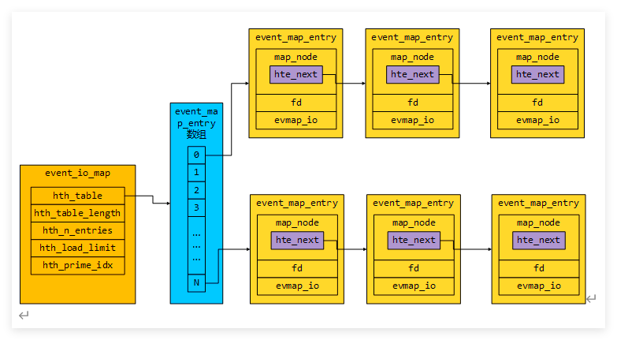
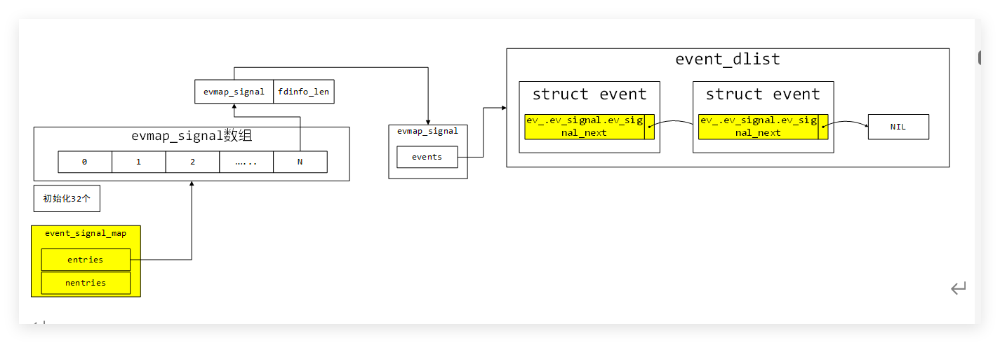
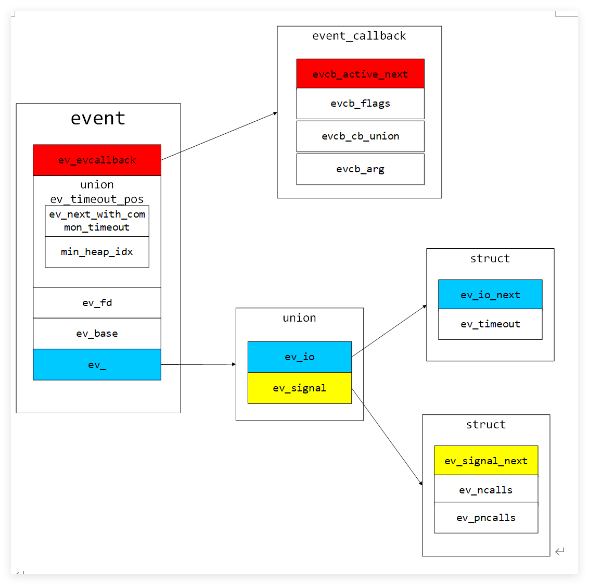
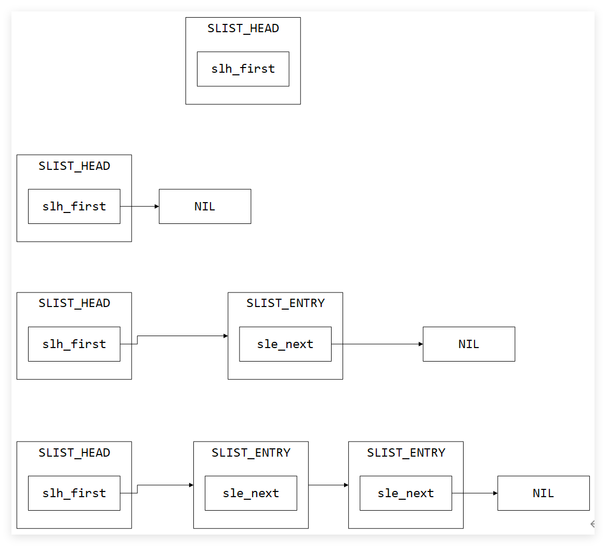
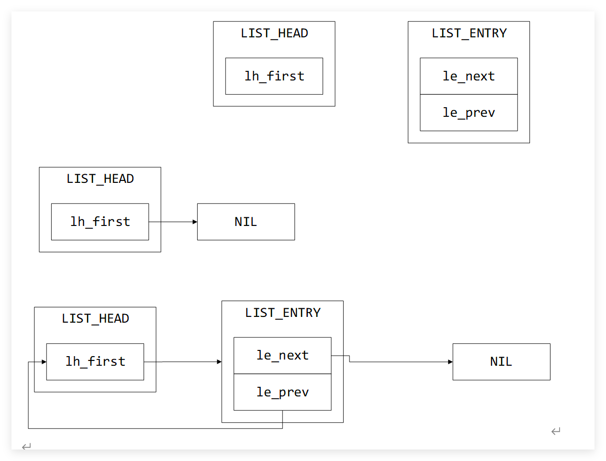
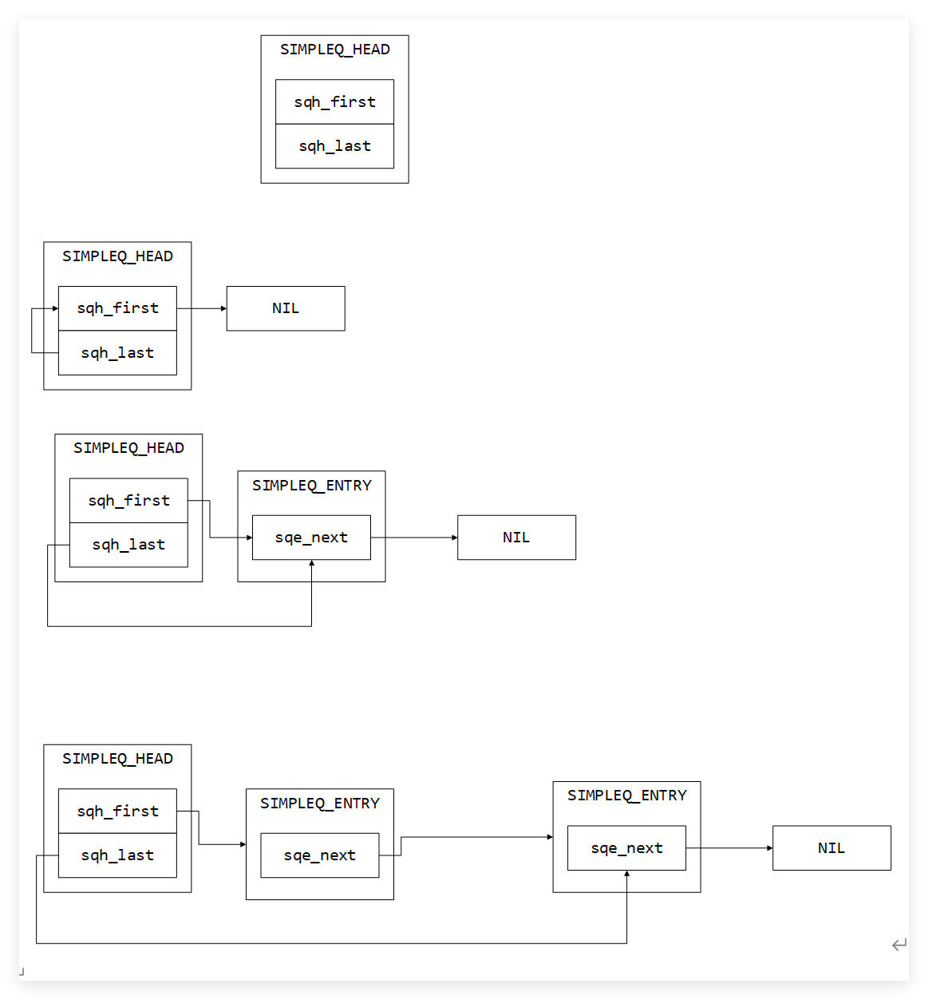
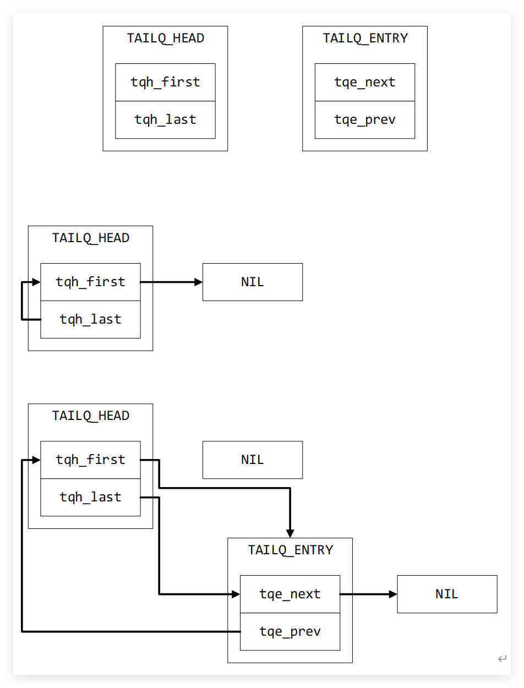

## struct event


~~~c
struct event {
	struct event_callback ev_evcallback;
    
	/* for managing timeouts */
	union {
		////如果大量事件的超时时间完全相同，为了优化性能，Libevent 会把它们串成一个**双向链表**。
		TAILQ_ENTRY(event) ev_next_with_common_timeout;
		size_t min_heap_idx;//普通超时/离散超时
	} ev_timeout_pos;
	evutil_socket_t ev_fd;

	short ev_events;
	short ev_res;		/* result passed to event callback */

	struct event_base *ev_base;
	union {
		/* used for io events */
		struct {
			LIST_ENTRY (event) ev_io_next;
			struct timeval ev_timeout;
		} ev_io;

		/* used by signal events */
		struct {
			LIST_ENTRY (event) ev_signal_next;
			short ev_ncalls;
			/* Allows deletes in callback */
			short *ev_pncalls;
		} ev_signal;
	} ev_;

	struct timeval ev_timeout;
};

~~~

## struct event_callback
~~~c
struct event_callback {
	TAILQ_ENTRY(event_callback) evcb_active_next;
	short evcb_flags;
	ev_uint8_t evcb_pri;	/* smaller numbers are higher priority */
	ev_uint8_t evcb_closure;
	/* allows us to adopt for different types of events */
        union {
		void (*evcb_callback)(evutil_socket_t, short, void *);
		void (*evcb_selfcb)(struct event_callback *, void *);
		void (*evcb_evfinalize)(struct event *, void *);
		void (*evcb_cbfinalize)(struct event_callback *, void *);
	} evcb_cb_union;
	void *evcb_arg;
};
~~~


初始化比较简单，主要是申请event内存，然后对event的各个成员赋初值。大致流程如下：
- event_new
- mm_calloc
- event_assign

## struct <font color="#4bacc6">event_io_map</font>

`struct event_io_map` 是一个非常关键的**内部映射表（Registry）**。

简单来说，它的核心作用是：**建立“文件描述符（fd）”到“事件对象（struct event）”之间的关联。**

当底层的 `epoll_wait` 告诉你“网络套接字 `fd = 5` 有数据可读了”时，Libevent 必须立刻知道：**“`fd = 5` 对应的是上层的哪一个 `event` 结构体？我该调用哪个回调函数？”** `struct event_io_map` 就是用来快速回答这个问题的。

底层的 `epoll` 只认 `fd`，上层的 Libevent 只认 `event`。`event_io_map` 就是连接这两者的**桥梁**

- **添加事件 (`event_add`)：** 当你调用 `event_add(ev)` 监听一个 socket 时，Libevent 会把这个 `ev->ev_fd` 作为 Key，`ev` 本身作为 Value，**存入** `event_io_map` 中。
  
- **事件触发 (`event_base_loop`)：** 当 `epoll_wait` 返回了有事件发生的 `fd` 时，Libevent 内部会调用类似 `evmap_io_active_(base, fd, res)` 的函数，拿着这个 `fd` 去 `event_io_map` 里**查找**对应的 `event` 对象，然后将其放入激活队列中准备执行回调。
  
- **删除事件 (`event_del`)：** 当你不想监听了，Libevent 会从 `event_io_map` 中把该 `fd` 对应的记录**擦除**。

`struct event_io_map` 就是 Libevent 内部的**路由表**。它把底层的数字 `fd` 翻译成上层的结构体 `event`，是整个事件分发循环（Event Loop）能高效运转的核心数据结构之一。

`struct event_io_map`具有两种定义

1. 数组表

```c
struct event_io_map {
	void** entries;
    int   nentries;
}
```


2. 哈希表

```c
#ifdef EVMAP_USE_HT
#define HT_NO_CACHE_HASH_VALUES
#include "ht-internal.h"
struct event_map_entry;
HT_HEAD(event_io_map, event_map_entry);
#else
#define event_io_map event_signal_map
#endif
```
```c
#define HT_ENTRY(type)                          \
  struct {                                      \
    struct type *hte_next;                      \
    unsigned hte_hash;                          \
  }
```

```c
struct event_map_entry {
	HT_ENTRY(event_map_entry) map_node;
	evutil_socket_t fd;
	union { /* This is a union in case we need to make more things that can
			   be in the hashtable. */
		struct evmap_io evmap_io;
	} ent;
};
```

```cpp
  struct event_io_map {                                                         
    /* The hash table itself. */                                        
    struct event_map_entry **hth_table;                                         
    /* How long is the hash table? */                                   
    unsigned hth_table_length;                                          
    /* How many elements does the table contain? */                     
    unsigned hth_n_entries;                                             
    /* How many elements will we allow in the table before resizing it? */ 
    unsigned hth_load_limit;                                            
    /* Position of hth_table_length in the primes table. */             
    int hth_prime_idx;                                                  
  }
```

结构图



此结构体根据编译宏的不同，它有两重身份:

**身份一：信号映射表（Signal Map）** 无论在什么系统下，它都用来将**信号编号**（比如 `SIGINT`、`SIGTERM`）映射到对应的 `struct event` 链表上。当系统捕捉到某个信号时，Libevent 通过它快速找到是谁订阅了这个信号。

**身份二：I/O 映射表（IO Map）** 注意看注释中的这句话：*“If EVMAP_USE_HT is not defined, this structure is also used as event_io_map”*。 意思是说：**如果没有启用哈希表（Hash Table），那么上一问提到的 `event_io_map` 底层其实就是这个 `event_signal_map` 结构体！** 此时，它负责将 **FD（文件描述符）** 映射到事件链表。


## struct <font color="#4bacc6">event_config_entry</font>

libevent 中的事件配置项。

通过使用 `event_config_entry` 结构体，可以在 libevent 中定义和管理多个事件配置项，并按照链表的方式进行链接和访问。每个配置项都包含一个要避免使用的网络通信方法

```c
struct event_config_entry {
	TAILQ_ENTRY(event_config_entry) next;

	const char *avoid_method;//要避免使用的网络通信方法。
};
```
TAILQ_ENTRY 见：[[Macro function]]


[命名约定 - OpenResty C 语言编码风格指南](https://jayce.github.io/openresty-coding-style-guide/book/ch-01-naming-convention.html)
## struct <font color="#4bacc6">event_base</font>

此结构体保存以下关键数据
- 网络io事件
- 事件事件
- 信号事件
- 活动的事件队列
- 信号操作函数接口
- IO操作函数接口

```c
struct event_base {
	//一个指向特定于后端数据的指针，用于描述这个event_base端。比如epoll select
	const struct eventop *evsel;
	//一个指向特定于后端数据的指针，用于指向底层事件驱动后端的实现。比如 epoolops pollops selectops 
	void *               evbase; 

    //用于描述在下次调度时需要通知后端更改的事件 O(1)
	struct event_changelist changelist;
	
    //一个指向特定于信号处理后端数据的指针，用于描述后端event_base*用于信号处理。
	const struct eventop *evsigsel;
    
    //一个结构体，用于实现信号处理通用代码的数据。
	struct evsig_info sig;

    //用于表示当前虚拟事件数量。
	int virtual_event_count;
    
    //用于表示最大虚拟事件数量。
	int virtual_event_count_max;
    
    //用于表示已添加到event_base的事件数量。
	int event_count;
    
    //用于表示最大已添加到event_base的事件数量。
	int event_count_max;
    
    //用于表示当前活动事件数量。
	int event_count_active;
    
    //用于表示最大活动事件数量。
	int event_count_active_max;

    //用于表示是否应该在处理完事件后终止循环。
	int event_gotterm;
    
	
    //用于表示是否应该立即终止循环。
	int event_break;
    
    //用于表示是否应该在处理完事件后继续执行循环。
	int event_continue;
 
    //用于表示当前正在运行的事件优先级。
	int event_running_priority;

    //用于表示是否正在运行event_base_loop函数，以防止重入调用。
	int running_loop;

	/** Set to the number of deferred_cbs we've made 'active' in the
	 * loop.  This is a hack to prevent starvation; it would be smarter
	 * to just use event_config_set_max_dispatch_interval's max_callbacks
	 * feature */
    //用于表示已 deferred_cbs 数量
	int n_deferreds_queued;

	/* Active event management. */
	/** An array of nactivequeues queues for active event_callbacks (ones
	 * that have triggered, and whose callbacks need to be called).  Low
	 * priority numbers are more important, and stall higher ones.
	 */
    //用于存储活动事件队列。
	struct evcallback_list *activequeues;
	
	//用于表示活动事件队列的数量
	int nactivequeues;
	
	/** A list of event_callbacks that should become active the next time
	 * we process events, but not this time. */
    //于存储应该在下次处理事件时激活的事件。
	struct evcallback_list active_later_queue;

	/* common timeout logic */

	/** An array of common_timeout_list* for all of the common timeout
	 * values we know. */
    //用于存储所有已知的时间outs。
	struct common_timeout_list **common_timeout_queues;

    /** The number of entries used in common_timeout_queues */
    //用于表示已使用的时间timeouts数量。
	int n_common_timeouts;
    
	/** The total size of common_timeout_queues. */
    //用于表示已分配的时间outs数量。
	int n_common_timeouts_allocated;

	/** Mapping from file descriptors to enabled (added) events */
	struct event_io_map io;

	/** Mapping from signal numbers to enabled (added) events. */
	struct event_signal_map sigmap;

	/** Priority queue of events with timeouts. */
    //1个优先队列，用于存储具有超时的事件。
	struct min_heap timeheap;

	/** Stored timeval: used to avoid calling gettimeofday/clock_gettime
	 * too often. */
    //用于存储当前时间，以避免频繁调用gettimeofday/clock_gettime。
	struct timeval tv_cache;
	
    //，用于实现单调时钟。
	struct evutil_monotonic_timer monotonic_timer;

	/** Difference between internal time (maybe from clock_gettime) and
	 * gettimeofday. */
    //用于存储内部时间与gettimeofday之间的差异。
	struct timeval tv_clock_diff;
    
	/** Second in which we last updated tv_clock_diff, in monotonic time. */
    //用于存储上次更新tv_clock_diff时的单调时间。
	time_t last_updated_clock_diff;

#ifndef EVENT__DISABLE_THREAD_SUPPORT
	/* threading support */
	/** The thread currently running the event_loop for this base */
	unsigned long th_owner_id;
	/** A lock to prevent conflicting accesses to this event_base */
	void *th_base_lock;
	/** A condition that gets signalled when we're done processing an
	 * event with waiters on it. */
	void *current_event_cond;
	/** Number of threads blocking on current_event_cond. */
	int current_event_waiters;
#endif
	/** The event whose callback is executing right now */
	struct event_callback *current_event;

#ifdef _WIN32
	/** IOCP support structure, if IOCP is enabled. */
    /**：一个指向`event_iocp_port`结构体的指针，如果在Windows平台上使用IOCP（I/O Completion Port）作为事件驱动后端，则使用此字段。
*/
	struct event_iocp_port *iocp;
#endif

	/** Flags that this base was configured with */
    //`flags`：一个枚举类型，用于表示`event_base`的配置标志。
    
	enum event_base_config_flag flags;
	
    //，用于表示最大调度时间。
	struct timeval max_dispatch_time;
    
	int max_dispatch_callbacks;//用于表示最大调度回调数量。
	int limit_callbacks_after_prio;//用于表示在达到特定优先级后限制回调数量。

	/* Notify main thread to wake up break, etc. */
	/** True if the base already has a pending notify, and we don't need
	 * to add any more. */
	int is_notify_pending;//用于表示`event_base`是否已经有一个待处理的通知。
	/** A socketpair used by some th_notify functions to wake up the main
	 * thread. */
    
    //用于free base
	evutil_socket_t th_notify_fd[2];//一个套接字对，用于在另一个线程中唤醒主线程。
	/** An event used by some th_notify functions to wake up the main
	 * thread. */
    
	struct event th_notify;//用于在主线程中唤醒其他线程。

	/** A function used to wake up the main thread from another thread. */
    /**`th_notify`：一个`event`结构体，用于在主线程中唤醒其他线程。*/
	int (*th_notify_fn)(struct event_base *base);

	/** Saved seed for weak random number generator. Some backends use
	 * this to produce fairness among sockets. Protected by th_base_lock. */
    //一个`evutil_weakrand_state`结构体，用于存储弱随机数生成器的种子。
	struct evutil_weakrand_state weakrand_seed;

	/** List of event_onces that have not yet fired. */
    /**`once_events`：一个`LIST_HEAD`结构体，用于存储尚未触发的事件。*/
	LIST_HEAD(once_event_list, event_once) once_events;

};

```

| **参数名称**                      | **类型**                                   | **意义**                                                                                    |
| ----------------------------- | ---------------------------------------- | ----------------------------------------------------------------------------------------- |
| `evsel`                       | `const struct eventop *`                 | 指向储存底层事件处理的接口函数, 比如 select poll epoll等常见的IO多路复用函数                                         |
| `evbase`                      | `void *`                                 | 存储对应底层事件接口函数需要保存的事件相关数据结构。比如 epoll 对<br>应的 struct epollops。select 对应的 struct selectops... |
| `changelist`                  | `struct event_changelist`                | 描述在下次调度时需要通知后端更改的事件。                                                                      |
| `evsigsel`                    | `const struct eventop *`                 | 指向特定于信号处理后端数据的指针，用于描述信号处理。主要是添加信号事件函数指针，删除信号事件函数指针                                        |
| `sig`                         | `struct evsig_info`                      | 实现信号处理通用代码的数据。以及信号处理的 socketpair                                                          |
| `virtual_event_count`         | `int`                                    | 当前虚拟事件的数量。                                                                                |
| `virtual_event_count_max`     | `int`                                    | 最大虚拟事件的数量。                                                                                |
| `event_count`                 | `int`                                    | 已添加到 `event_base` 的事件数量。                                                                  |
| `event_count_max`             | `int`                                    | 最大已添加到 `event_base` 的事件数量。                                                                |
| `event_count_active`          | `int`                                    | 当前活动事件的数量。                                                                                |
| `event_count_active_max`      | `int`                                    | 最大活动事件的数量。                                                                                |
| `event_gotterm`               | `int`                                    | 是否应在处理完事件后终止循环。                                                                           |
| `event_break`                 | `int`                                    | 是否应立即终止循环。                                                                                |
| `event_continue`              | `int`                                    | 是否应在处理完事件后继续执行循环。                                                                         |
| `event_running_priority`      | `int`                                    | 当前正在运行的事件优先级。                                                                             |
| `running_loop`                | `int`                                    | 是否正在运行 `event_base_loop` 函数，以防止重入调用。                                                      |
| `n_deferreds_queued`          | `int`                                    | 已 `deferred_cbs` 数量，用于防止饥饿。                                                               |
| `activequeues`                | `struct evcallback_list *`               | 存储活动事件队列。注意这里 activequeues 是一个数组，数组下标代表事件<br>触发的优先级，数组下标越小，优先级越高，同等条件下，越先调用其事件<br>对应的回调函数 |
| `nactivequeues`               | `int`                                    | 活动事件队列的数量。                                                                                |
| `active_later_queue`          | `struct evcallback_list`                 | 存储应该在下次处理事件时激活的事件。                                                                        |
| `common_timeout_queues`       | `struct common_timeout_list **`          | 存储所有已知的时间timeouts(                                                                        |
| `n_common_timeouts`           | `int`                                    | 已使用的时间timeouts 数量。                                                                        |
| `n_common_timeouts_allocated` | `int`                                    | 已分配的时间timeouts 数量。                                                                        |
| `io`                          | `struct event_io_map`                    | IO 事件 map；总共对应的两种数据结构，其中一种是 fd 对应的数据；另外<br>一种是 fd 对应的 hash 表                              |
| `sigmap`                      | `struct event_signal_map`                | 存储信号编号到已添加事件的映射。信号事件 map，对应一个数组，以信号的 id 作为数组下标                                            |
| `timeheap`                    | `struct min_heap`                        | 存储具有超时的事件的优先队列。以 event 里面 ev_timeout 作为最小堆的比较基准                                           |
| `tv_cache`                    | `struct timeval`                         | 存储当前时间，以避免频繁调用 `gettimeofday/clock_gettime`。                                              |
| `monotonic_timer`             | `struct evutil_monotonic_timer`          | 用于实现单调时钟。                                                                                 |
| `tv_clock_diff`               | `struct timeval`                         | 存储内部时间与 `gettimeofday` 之间的差异。                                                             |
| `last_updated_clock_diff`     | `time_t`                                 | 上次更新 `tv_clock_diff` 时的单调时间。                                                              |
| `th_owner_id`                 | `unsigned long`                          | 当前运行 `event_loop` 的线程 ID。                                                                 |
| `th_base_lock`                | `void *`                                 | 防止对 `event_base` 的冲突访问的锁。                                                                 |
| `current_event_cond`          | `void *`                                 | 当处理完事件后，通知有等待的线程的条件变量。                                                                    |
| `current_event_waiters`       | `int`                                    | 在 `current_event_cond` 上阻塞的线程数量。                                                          |
| `current_event`               | `struct event_callback *`                | 当前正在执行其回调的事件。                                                                             |
| `iocp`                        | `struct event_iocp_port *`               | 如果在 Windows 上使用 IOCP，指向 `event_iocp_port` 结构体。                                            |
| `flags`                       | `enum event_base_config_flag`            | 表示 `event_base` 的配置标志。                                                                    |
| `max_dispatch_time`           | `struct timeval`                         | 最大调度时间。                                                                                   |
| `max_dispatch_callbacks`      | `int`                                    | 最大调度回调数量。                                                                                 |
| `limit_callbacks_after_prio`  | `int`                                    | 在达到特定优先级后限制回调数量。                                                                          |
| `is_notify_pending`           | `int`                                    | 是否已经有待处理的通知。                                                                              |
| `th_notify_fd`                | `evutil_socket_t[2]`                     | 一个套接字对，用于唤醒主线程。                                                                           |
| `th_notify`                   | `struct event`                           | 用于在主线程中唤醒其他线程的事件。                                                                         |
| `th_notify_fn`                | `int (*)(struct event_base *base)`       | 用于从另一个线程唤醒主线程的函数。                                                                         |
| `weakrand_seed`               | `struct evutil_weakrand_state`           | 存储弱随机数生成器的种子。                                                                             |
| `once_events`                 | `LIST_HEAD(once_event_list, event_once)` | 存储尚未触发的事件。                                                                                |
|                               |                                          |                                                                                           |
## enum event_base_config_flag
~~~c
/**
   A flag passed to event_config_set_flag().

    These flags change the behavior of an allocated event_base.

    @see event_config_set_flag(), event_base_new_with_config(),
       event_method_feature
 */
enum event_base_config_flag {
	/** Do not allocate a lock for the event base, even if we have
	    locking set up.

	    Setting this option will make it unsafe and nonfunctional to call
	    functions on the base concurrently from multiple threads.
	*/
	EVENT_BASE_FLAG_NOLOCK = 0x01,
	/** Do not check the EVENT_* environment variables when configuring
	    an event_base  */
	EVENT_BASE_FLAG_IGNORE_ENV = 0x02,
	/** Windows only: enable the IOCP dispatcher at startup

	    If this flag is set then bufferevent_socket_new() and
	    evconn_listener_new() will use IOCP-backed implementations
	    instead of the usual select-based one on Windows.

	    Note: it is experimental feature, and has some bugs.
	 */
	EVENT_BASE_FLAG_STARTUP_IOCP = 0x04,
	/** Instead of checking the current time every time the event loop is
	    ready to run timeout callbacks, check after each timeout callback.
	 */
	EVENT_BASE_FLAG_NO_CACHE_TIME = 0x08,

	/** If we are using the epoll backend, this flag says that it is
	    safe to use Libevent's internal change-list code to batch up
	    adds and deletes in order to try to do as few syscalls as
	    possible.  Setting this flag can make your code run faster, but
	    it may trigger a Linux bug: it is not safe to use this flag
	    if you have any fds cloned by dup() or its variants.  Doing so
	    will produce strange and hard-to-diagnose bugs.

	    This flag can also be activated by setting the
	    EVENT_EPOLL_USE_CHANGELIST environment variable.

	    This flag has no effect if you wind up using a backend other than
	    epoll.
	 */
	EVENT_BASE_FLAG_EPOLL_USE_CHANGELIST = 0x10,

	/** Ordinarily, Libevent implements its time and timeout code using
	    the fastest monotonic timer that we have.  If this flag is set,
	    however, we use less efficient more precise timer, assuming one is
	    present.
	 */
	EVENT_BASE_FLAG_PRECISE_TIMER = 0x20,

	/** With EVENT_BASE_FLAG_PRECISE_TIMER,
	    epoll backend will use timerfd for more accurate timers, this will
	    allows to disable this.

	    That said that this is something in between lack of
	    (CLOCK_MONOTONIC_COARSE) and enabled EVENT_BASE_FLAG_PRECISE_TIMER
	    (CLOCK_MONOTONIC + timerfd).

	    This flag has no effect if you wind up using a backend other than
	    epoll and if you do not have EVENT_BASE_FLAG_PRECISE_TIMER enabled.
	 */
	EVENT_BASE_FLAG_EPOLL_DISALLOW_TIMERFD = 0x40,

	/** Use signalfd(2) to handle signals over sigaction/signal.
	 *
	 * But note, that in some edge cases signalfd() may works differently.
	 */
	EVENT_BASE_FLAG_USE_SIGNALFD = 0x80,
};

~~~
## struct <font color="#4bacc6">eventop</font>
```c
/** 用于定义给定事件基础结构的后端的结构体。 */

struct eventop {
    /** 后端的名称。 */
    const char *name;

    /** 初始化函数，用于设置事件基础结构以使用该后端。它应该创建一个新的结构体，
     * 保存运行该后端所需的任何信息，并将其返回。返回的指针将由event_init存储在
     * event_base.evbase字段中。如果初始化失败，该函数应返回NULL。 */
    void *(*init)(struct event_base *);

    /** 启用给定文件描述符或信号的读写事件。'events'参数表示我们要启用的事件类型，
     * 可能是EV_READ、EV_WRITE、EV_SIGNAL和EV_ET的组合。'old'参数表示之前在该
     * 文件描述符上启用的事件。'fdinfo'参数是与文件描述符相关联的结构体，在evmap
     * 中管理；其大小由下面的fdinfo_len字段定义。第一次添加文件描述符时，
     * 它将被设置为0。该函数应在成功时返回0，在错误时返回-1。 */
    int (*add)(struct event_base *, evutil_socket_t fd, short old, short events, void *fdinfo);

    /** 类似于'add'函数，但'events'参数表示我们要禁用的事件类型。 */
    int (*del)(struct event_base *, evutil_socket_t fd, short old, short events, void *fdinfo);

    /** 实现事件循环的核心功能。它需要检查哪些已添加的事件已准备就绪，并为每个活动事件
     * 调用event_active函数（通常通过event_io_active等方式）。该函数应在成功时返回0，
     * 在错误时返回-1。 */
    int (*dispatch)(struct event_base *, struct timeval *);

    /** 用于清理和释放事件基础结构中的数据的函数。 */
    void (*dealloc)(struct event_base *);

    /** 标志：如果我们在fork之后需要重新初始化事件基础结构，则设置此标志。 */
    int need_reinit;

    /** 支持的事件方法特性的位数组。 */
    enum event_method_feature features;

    /** 每个具有一个或多个活动事件的文件描述符应记录的额外信息的长度。
     * 此信息作为每个文件描述符的evmap条目的一部分记录，并作为参数传递给上述的
     * 'add'和'del'函数。 */
    size_t fdinfo_len;
};

```


| **参数名称**      | **类型**                                                                                    | **意义**                                                      |
| ------------- | ----------------------------------------------------------------------------------------- | ----------------------------------------------------------- |
| `name`        | `const char *`                                                                            | 后端的名称。                                                      |
| `init`        | `void *(*)(struct event_base *)`                                                          | 初始化函数，用于设置事件基础结构以使用该后端。创建和返回新的结构体，返回 `NULL` 表示初始化失败。        |
| `add`         | `int (*)(struct event_base *, evutil_socket_t fd, short old, short events, void *fdinfo)` | 启用给定文件描述符或信号的读写事件。成功时返回 `0`，失败时返回 `-1`。                     |
| `del`         | `int (*)(struct event_base *, evutil_socket_t fd, short old, short events, void *fdinfo)` | 禁用给定文件描述符或信号的读写事件。成功时返回 `0`，失败时返回 `-1`。                     |
| `dispatch`    | `int (*)(struct event_base *, struct timeval *)`                                          | 实现事件循环的核心功能，检查已添加事件是否准备好，并调用事件回调函数。成功时返回 `0`，失败时返回 `-1`。    |
| `dealloc`     | `void (*)(struct event_base *)`                                                           | 清理和释放事件基础结构中的数据。                                            |
| `need_reinit` | `int`                                                                                     | 标志：如果在 fork 之后需要重新初始化事件基础结构，则设置此标志。                         |
| `features`    | `enum event_method_feature`                                                               | 支持的事件方法特性的位数组。                                              |
| `fdinfo_len`  | `size_t`                                                                                  | 每个具有一个或多个活动事件的文件描述符记录的额外信息的长度。该信息作为每个文件描述符的 `evmap` 条目的一部分。 |

---

## struct <font color="#4bacc6">event_config</font>

```c
/** Internal structure: describes the configuration we want for an event_base
 * that we're about to allocate. */
struct event_config {
    ////于定义一个双向链表的头部。它将被用作存储event_config_entry类型的结构体的链表。
	TAILQ_HEAD(event_configq, event_config_entry) entries;
    
    //用于提示事件配置所需的CPU数量。
	int n_cpus_hint;
    //指定最大分派间隔的时间值。
	struct timeval max_dispatch_interval;
    //指定在一次循环中最大的分派回调数量。
	int max_dispatch_callbacks;
    //用于限制在特定优先级之后的回调数量。
	int limit_callbacks_after_prio;
    //指定要求的事件方法特性。
    //event_config_require_featureEV_FEATURE_ET：要求支持边沿触发的后端等
	enum event_method_feature require_features;
    //指定事件基础配置的标志。
	enum event_base_config_flag flags;//event_config_set_flag 设置具体可用参数见上文
};
```
<font color="#8064a2">TAILQ_HEAD</font> 见：[[Macro function]]
~~~- **语义清晰**：`entries` 直观地表示这是一个存放“条目”（entries）的集合，符合该结构体的用途，即配置多个条目。~~~
- **约定俗成**：`entries` 是一个常见的命名约定，许多基于双向链表的数据结构都采用类似的命名，使代码结构统一、可读性强.
- `TAILQ_HEAD` 是一个宏，用来定义一个双向链表的结构体。宏展开后，`entries` 是一个链表头，类型为 `event_configq`。
- `event_configq` 是一个类型，代表链表的头。它并不直接存储数据，而是通过 `entries` 来管理链表中的节点。
- `event_config_entry` 是链表中的节点类型，它代表具体的配置项，每个节点存储一个配置条目的数据。

---

## struct timeval 
```c
/* A time value that is accurate to the nearest
 * microsecond but also has a range of years.  */
struct timeval
{
    __time_t tv_sec;   /* Seconds.  */
    __suseconds_t tv_usec;  /* Microseconds.  */
};
```

## struct event_signal_map , evmap_sigal
信号事件相关结构体定义如下

```c
struct eveent_dlist {
	struct event* lh_first;
}
```


```c
/* An entry for an evmap_signal list: notes all the events that want to know
   when a signal triggers. */
struct evmap_signal {
	struct event_dlist events;
};
```


```c
/* Used to map signal numbers to a list of events.  If EVMAP_USE_HT is not
   defined, this structure is also used as event_io_map, which maps fds to a
   list of events.
*/
struct event_signal_map {
	/* An array of evmap_io * or of evmap_signal *; empty entries are
	 * set to NULL. */
	void **entries;
	/* The number of entries available in entries */
	int nentries;
};

```

对应event_signal_map表结构如下




event_signal_map.这个结构体的设计非常精简，只有两个成员，但实现了一个**动态扩容的指针数组**。

#### ① `void entries;` （二级指针/指针数组）

这是一个指向指针数组的指针。数组里的每一个元素都是一个 `void *` 指针：

- **作为 Signal Map 时**：数组的**下标**就是信号编号（如 `signum`）。`entries[SIGINT]` 指向一个专门管理该信号的结构体（`struct evmap_signal`）。
- **作为 IO Map 时**：数组的**下标**就是文件描述符（如 `fd`）。`entries[fd]` 指向一个专门管理该 FD 的结构体（`struct evmap_io`）。
- 如果某个信号或 FD 没有被监听，对应的 `entries[i]` 就会被设置为 `NULL`。

#### ② `int nentries;` （当前数组容量）

记录当前 `entries` 数组一共可以容纳多少个元素。 因为信号数量（或 FD 数量）是动态增加的，当用户新添加的 `fd` 超过当前的 `nentries` 时，Libevent 会调用 `realloc` 对 `entries` 数组进行**动态扩容**，并更新 `nentries` 的值。

#### 为什么如此设计

##### 追求极致的 O(1) 性能

在 Linux/Unix 系统中，信号编号（通常 $1 \sim 64$）和文件描述符（从 $0$ 开始递增的整数）都是**连续且较小的非负整数**。

使用这种“动态数组”的设计，Libevent 在处理事件时：

- 想找 `fd = 5` 的事件？直接访问 `entries[5]`。
- 想找 `SIGINT (2)` 的事件？直接访问 `entries[2]`。

不需要任何复杂的哈希计算或树形查找，**一步到位，时间复杂度是纯粹的 O(1)**。

注释中提到的 `EVMAP_USE_HT`（Use Hash Table）是一个编译开关。

- **在 Windows 上**，由于 FD（Socket 句柄）数值极大且离散，Libevent 会定义 `EVMAP_USE_HT`，此时 `event_io_map` 底层会切换为哈希表（避免数组开得太大浪费内存）。
- **在 Linux 上**，通常不定义该宏，直接复用这个 `event_signal_map` 作为 `event_io_map`，享受数组带来的极速响应

## struct <font color="#4bacc6">evbuffer</font>

~~~c
struct evbuffer {
	/** The first chain in this buffer's linked list of chains. */
	struct evbuffer_chain *first;
	/** The last chain in this buffer's linked list of chains. */
	struct evbuffer_chain *last;

	/** Pointer to the next pointer pointing at the 'last_with_data' chain.
	 *
	 * To unpack:
	 *
	 * The last_with_data chain is the last chain that has any data in it.
	 * If all chains in the buffer are empty, it is the first chain.
	 * If the buffer has no chains, it is NULL.
	 *
	 * The last_with_datap pointer points at _whatever 'next' pointer_
	 * pointing at the last_with_data chain. If the last_with_data chain
	 * is the first chain, or it is NULL, then the last_with_datap pointer
	 * is &buf->first.
	 */
	struct evbuffer_chain **last_with_datap;

	/** Total amount of bytes stored in all chains.*/
	size_t total_len;
	/** Maximum bytes per one read */
	size_t max_read;

	/** Number of bytes we have added to the buffer since we last tried to
	 * invoke callbacks. */
	size_t n_add_for_cb;
	/** Number of bytes we have removed from the buffer since we last
	 * tried to invoke callbacks. */
	size_t n_del_for_cb;

#ifndef EVENT__DISABLE_THREAD_SUPPORT
	/** A lock used to mediate access to this buffer. */
	void *lock;
#endif
	/** True iff we should free the lock field when we free this
	 * evbuffer. */
	unsigned own_lock : 1;
	/** True iff we should not allow changes to the front of the buffer
	 * (drains or prepends). */
	unsigned freeze_start : 1;
	/** True iff we should not allow changes to the end of the buffer
	 * (appends) */
	unsigned freeze_end : 1;
	/** True iff this evbuffer's callbacks are not invoked immediately
	 * upon a change in the buffer, but instead are deferred to be invoked
	 * from the event_base's loop.	Useful for preventing enormous stack
	 * overflows when we have mutually recursive callbacks, and for
	 * serializing callbacks in a single thread. */
	unsigned deferred_cbs : 1;
#ifdef _WIN32
	/** True iff this buffer is set up for overlapped IO. */
	unsigned is_overlapped : 1;
#endif
	/** Zero or more EVBUFFER_FLAG_* bits */
	ev_uint32_t flags;

	/** Used to implement deferred callbacks. */
	struct event_base *cb_queue;

	/** A reference count on this evbuffer.	 When the reference count
	 * reaches 0, the buffer is destroyed.	Manipulated with
	 * evbuffer_incref and evbuffer_decref_and_unlock and
	 * evbuffer_free. */
	int refcnt;

	/** A struct event_callback handle to make all of this buffer's callbacks
	 * invoked from the event loop. */
	struct event_callback deferred;

	/** A doubly-linked-list of callback functions */
	LIST_HEAD(evbuffer_cb_queue, evbuffer_cb_entry) callbacks;

	/** The parent bufferevent object this evbuffer belongs to.
	 * NULL if the evbuffer stands alone. */
	struct bufferevent *parent;
};

~~~

|字段名称|类型|说明|
|---|---|---|
|`first`|`struct evbuffer_chain *`|指向缓冲区链表的第一个链段。|
|`last`|`struct evbuffer_chain *`|指向缓冲区链表的最后一个链段。|
|`last_with_datap`|`struct evbuffer_chain **`|指向最后一个包含数据的链段的指针。如果所有链段都为空，指向第一个链段；如果缓冲区没有链段，为 `NULL`。|
|`total_len`|`size_t`|所有链段中数据的总字节数。|
|`n_add_for_cb`|`size_t`|自上次调用回调函数以来，已添加到缓冲区中的字节数。|
|`n_del_for_cb`|`size_t`|自上次调用回调函数以来，从缓冲区中移除的字节数。|
|`lock`|`void *`|用于同步访问缓冲区的锁，避免多线程环境中的竞争条件。|
|`own_lock`|`unsigned`|如果为 `1`，表示在释放 `evbuffer` 时需要释放 `lock` 字段所占用的资源。|
|`freeze_start`|`unsigned`|如果为 `1`，表示不允许对缓冲区的开头进行修改。|
|`freeze_end`|`unsigned`|如果为 `1`，表示不允许对缓冲区的末尾进行修改。|
|`deferred_cbs`|`unsigned`|如果为 `1`，表示回调函数会被延迟到事件循环中执行。|
|`is_overlapped`|`unsigned`|在 Windows 系统上有效。如果为 `1`，表示设置了重叠 IO。|
|`flags`|`ev_uint32_t`|存储零个或多个 `EVBUFFER_FLAG_*` 标志位，用于设置缓冲区的属性。|
|`cb_queue`|`struct event_base *`|用于实现延迟回调的事件基础对象。|
|`refcnt`|`int`|缓冲区的引用计数。当引用计数为 `0` 时，缓冲区将被销毁。|
|`deferred`|`struct event_callback`|用于将所有回调函数从事件循环中调用的结构体。|
|`callbacks`|`LIST_HEAD(evbuffer_cb_queue, evbuffer_cb_entry)`|存储回调函数的双向链表。|
|`parent`|`struct bufferevent *`|指向包含此 `evbuffer` 的 `bufferevent` 对象。如果 `evbuffer` 是独立的，则为 `NULL`。|


## struct bufferevent
~~~c
struct bufferevent {

    /** Event base for which this bufferevent was created. */
    struct event_base *ev_base;
    
    /** Pointer to a table of function pointers to set up how this
        bufferevent behaves. */
    const struct bufferevent_ops *be_ops;

    /** A read event that triggers when a timeout has happened or a socket
        is ready to read data.  Only used by some subtypes of
        bufferevent. */
    struct event ev_read;

    /** A write event that triggers when a timeout has happened or a socket
        is ready to write data.  Only used by some subtypes of
        bufferevent. */
    struct event ev_write;

    /** An input buffer. Only the bufferevent is allowed to add data to
        this buffer, though the user is allowed to drain it. */
    struct evbuffer *input;

    /** An input buffer. Only the bufferevent is allowed to drain data
        from this buffer, though the user is allowed to add it. */
    struct evbuffer *output;
    struct event_watermark wm_read;
    struct event_watermark wm_write;
    bufferevent_data_cb readcb;
    bufferevent_data_cb writecb;
    /* This should be called 'eventcb', but renaming it would break
     * backward compatibility */
    bufferevent_event_cb errorcb;
    void *cbarg;
    struct timeval timeout_read;
    struct timeval timeout_write;

    /** Events that are currently enabled: currently EV_READ and EV_WRITE
        are supported. */
    short enabled;

};
~~~

- **`ev_base`**:
  
    - 指向 `event_base` 结构体，表示 `bufferevent` 所关联的事件基础设施。
- **`be_ops`**:
  
    - 指向 `bufferevent_ops` 结构体的指针，用于操作 `bufferevent` 的行为（如读写操作的具体实现）。
- **`ev_read`**:
  
    - `struct event` 类型的字段，用于处理读事件。这是一个底层的事件，用于监视文件描述符是否可读，或者监视超时事件。
- **`ev_write`**:
  
    - `struct event` 类型的字段，用于处理写事件。这也是一个底层的事件，用于监视文件描述符是否可写，或者监视超时事件。
- **`input`**:
  
    - 指向 `evbuffer` 结构体的指针，作为输入缓冲区。`bufferevent` 负责将数据添加到此缓冲区，而用户可以从中读取数据。
- **`output`**:
  
    - 指向 `evbuffer` 结构体的指针，作为输出缓冲区。`bufferevent` 负责从此缓冲区读取数据，而用户可以将数据写入该缓冲区。
- **`wm_read`** 和 **`wm_write`**:
  
    - `event_watermark` 结构体，定义了读写操作的水印值，用于控制在何时触发读或写事件。
- **`readcb`** 和 **`writecb`**:
  
    - 回调函数，用于处理读写操作。当数据可读或可写时，这些回调函数会被调用。
- **`errorcb`**:
  
    - 错误回调函数，用于处理 `bufferevent` 发生错误的情况。为了兼容性，虽然应该命名为 `eventcb`，但保留了旧名称。
- **`cbarg`**:
  
    - 指向用户定义的数据的指针，这些数据会传递给回调函数。
- **`timeout_read`** 和 **`timeout_write`**:
  
    - `struct timeval` 类型的字段，定义了读写操作的超时时间。用于在读取或写入操作超时时触发相应的事件。
- **`enabled`**:
  
    - 记录当前启用的事件类型。可以是 `EV_READ`、`EV_WRITE` 或它们的组合。
- 这个结构体用于 `libevent` 中的缓冲事件处理机制，使得你可以处理异步的 I/O 操作，同时管理数据的读写缓冲区。

## struct bufferevent_private

~~~c

/** Parts of the bufferevent structure that are shared among all bufferevent

 * types, but not exposed in bufferevent_struct.h. */

struct bufferevent_private {

    /** The underlying bufferevent structure. */
    struct bufferevent bev;

    /** Evbuffer callback to enforce watermarks on input. */
    struct evbuffer_cb_entry *read_watermarks_cb;

    /** If set, we should free the lock when we free the bufferevent. */
    unsigned own_lock : 1;
  
    /** Flag: set if we have deferred callbacks and a read callback is   * pending. */
    unsigned readcb_pending : 1;
    
    /** Flag: set if we have deferred callbacks and a write callback is
     * pending. */
    unsigned writecb_pending : 1;

    /** Flag: set if we are currently busy connecting. */
    unsigned connecting : 1;

    /** Flag: set if a connect failed prematurely; this is a hack for
     * getting around the bufferevent abstraction. */
    unsigned connection_refused : 1;

    /** Set to the events pending if we have deferred callbacks and
     * an events callback is pending. */
    short eventcb_pending;
  

    /** If set, read is suspended until one or more conditions are over.
     * The actual value here is a bitfield of those conditions; see the
     * BEV_SUSPEND_* flags above. */
    bufferevent_suspend_flags read_suspended;

    /** If set, writing is suspended until one or more conditions are over.
     * The actual value here is a bitfield of those conditions; see the
     * BEV_SUSPEND_* flags above. */
    bufferevent_suspend_flags write_suspended;

    /** Set to the current socket errno if we have deferred callbacks and
     * an events callback is pending. */
    int errno_pending;
    
    /** The DNS error code for bufferevent_socket_connect_hostname */
    int dns_error;

    /** Used to implement deferred callbacks */
    struct event_callback deferred;

    /** The options this bufferevent was constructed with */
    enum bufferevent_options options;

      /** Current reference count for this bufferevent. */
    int refcnt;

    /** Lock for this bufferevent.  Shared by the inbuf and the outbuf.
     * If NULL, locking is disabled. */
    void *lock;

    /** No matter how big our bucket gets, don't try to read more than this
     * much in a single read operation. */
    ev_ssize_t max_single_read;

    /** No matter how big our bucket gets, don't try to write more than this
     * much in a single write operation. */
    ev_ssize_t max_single_write;

    /** Rate-limiting information for this bufferevent */
    struct bufferevent_rate_limit *rate_limiting;


    /* Saved conn_addr, to extract IP address from it.
     *
     * Because some servers may reset/close connection without waiting clients,
     * in that case we can't extract IP address even in close_cb.
     * So we need to save it, just after we connected to remote server, or
     * after resolving (to avoid extra dns requests during retrying, since UDP
     * is slow) */
    union {
        struct sockaddr_in6 in6;
        struct sockaddr_in in;
    } conn_address;
    
    struct evdns_getaddrinfo_request *dns_request;

};
~~~

`bufferevent_private` 结构体是 `bufferevent` 结构体的一个扩展部分，包含了用于实现 `bufferevent` 的私有数据和状态。这些成员在 `bufferevent_struct.h` 头文件中并未暴露，旨在实现封装和内部管理。

- **`struct bufferevent bev`**:
  
    - 这是 `bufferevent` 结构体的基础部分。`bufferevent_private` 通过包含 `bufferevent` 结构体，继承了 `bufferevent` 的所有公开接口和基本功能。
- **`struct evbuffer_cb_entry *read_watermarks_cb`**:
  
    - 用于处理输入缓冲区的watermarks回调。这是 `evbuffer` 结构体的回调机制的一部分，用于实现流量控制或其他与数据处理相关的逻辑。
- **`unsigned own_lock : 1`**:
  
    - 标记是否在释放 `bufferevent` 时需要释放锁。如果设置了该标志，则 `bufferevent` 的销毁过程将包括锁的释放。
- **`unsigned readcb_pending : 1`** 和 **`unsigned writecb_pending : 1`**:
  
    - 分别表示是否有待处理的读回调或写回调。这些标志用于处理延迟的回调函数，确保它们在适当的时间被调用。
- **`unsigned connecting : 1`**:
  
    - 指示当前是否正在进行连接操作。这有助于处理与连接状态相关的特殊情况。
- **`unsigned connection_refused : 1`**:
  
    - 标记连接是否被拒绝。这是为了绕过 `bufferevent` 抽象的一种技巧，用于处理连接失败的情况。
- **`short eventcb_pending`**:
  
    - 如果有延迟的回调并且事件回调待处理，这里保存待处理的事件。
- **`bufferevent_suspend_flags read_suspended`** 和 **`bufferevent_suspend_flags write_suspended`**:
  
    - 分别用于指示读取和写入操作是否被暂停。这里使用位域来表示不同的暂停条件。
- **`int errno_pending`**:
  
    - 保存当前待处理的 `errno` 错误码，以便在事件回调中使用。
- **`int dns_error`**:
  
    - 用于存储与 DNS 解析相关的错误码，特别是用于 `bufferevent_socket_connect_hostname` 的操作。
- **`struct event_callback deferred`**:
  
    - 用于实现延迟回调的机制，允许在特定条件满足时才执行回调函数。
- **`enum bufferevent_options options`**:
  
    - 存储创建 `bufferevent` 时使用的选项。这可以包括各种配置选项，如缓冲区大小、事件类型等。
- **`int refcnt`**:
  
    - 当前 `bufferevent` 的引用计数，用于管理内存和资源的生命周期。
- **`void *lock`**:
  
    - 指向用于保护 `bufferevent` 结构体中共享资源的锁。如果为 `NULL`，则表示锁定机制被禁用。
- **`ev_ssize_t max_single_read`** 和 **`ev_ssize_t max_single_write`**:
  
    - 限制单次读取或写入操作的最大字节数，以避免在处理大数据量时出现性能问题或其他潜在问题。
- **`struct bufferevent_rate_limit *rate_limiting`**:
  
    - 用于实现速率限制的结构体，控制数据的传输速率。
- **`union { struct sockaddr_in6 in6; struct sockaddr_in in; } conn_address`**:
  
    - 保存连接地址，用于从服务器获取 IP 地址，即使在连接关闭时也能保留该信息。
- **`struct evdns_getaddrinfo_request *dns_request`**:
  
    - 用于 DNS 查询的请求结构体，协助处理域名解析过程。
- `bufferevent_private` 结构体封装了 `bufferevent` 结构体的实现细节，包括锁、缓冲区、水位、延迟回调、速率限制等。这种设计使得 `bufferevent` 的内部实现与对外接口隔离，提高了代码的模块化和可维护性，同时也提供了更强大的功能来处理网络事件和数据流

## struct min_heap


```c
typedef struct min_heap
{
	struct event** p;
	size_t n, a;
} min_heap_t;

static inline void	         min_heap_ctor_(min_heap_t* s);
static inline void	         min_heap_dtor_(min_heap_t* s);
static inline void	         min_heap_elem_init_(struct event* e);
static inline int	         min_heap_elt_is_top_(const struct event *e);
static inline int	         min_heap_empty_(min_heap_t* s);
static inline size_t	     min_heap_size_(min_heap_t* s);
static inline struct event*  min_heap_top_(min_heap_t* s);
static inline int	         min_heap_reserve_(min_heap_t* s, size_t n);
static inline int	         min_heap_push_(min_heap_t* s, struct event* e);
static inline struct event*  min_heap_pop_(min_heap_t* s);
static inline int	         min_heap_adjust_(min_heap_t *s, struct event* e);
static inline int	         min_heap_erase_(min_heap_t* s, struct event* e);
static inline void	         min_heap_shift_up_(min_heap_t* s, size_t hole_index, struct event* e);
static inline void	         min_heap_shift_up_unconditional_(min_heap_t* s, size_t hole_index, struct event* e);
static inline void	         min_heap_shift_down_(min_heap_t* s, size_t hole_index, struct event* e);
```

|                      |                                 |
| -------------------- | ------------------------------- |
| 函数                   | 函数说明                            |
| min_heap_ctor_       | 最小堆初始化函数                        |
| min_heap_dtor_       | 堆销毁函数                           |
| min_heap_top_        | 获取堆顶event                       |
| min_heap_push_       | 插入一个event                       |
| min_heap_shift_up_   | 向上调整元素位置，一般在堆里面添加（push）了event调用 |
| min_heap_shift_down_ | 向下调整，在堆里面删除了元素                  |


## struct common_timeout_list

TODO:
此结构体

```c
/* A list of events waiting on a given 'common' timeout value.  Ordinarily,
 * events waiting for a timeout wait on a minheap.  Sometimes, however, a
 * queue can be faster.
 **/
struct common_timeout_list {
	/* List of events currently waiting in the queue. */
	struct event_list events;
	/* 'magic' timeval used to indicate the duration of events in this
	 * queue. */
	struct timeval duration;
	/* Event that triggers whenever one of the events in the queue is
	 * ready to activate */
	struct event timeout_event;
	/* The event_base that this timeout list is part of */
	struct event_base *base;
};
```

## struct bufferevent_ops

`bufferevent_ops` 结构体定义了与 `bufferevent` 类型相关的操作表，用于处理不同类型的 `bufferevent` 实现。这种设计使得 `bufferevent` 可以有多个不同的实现类型，每种类型都有自己专门的操作函数

~~~c
struct bufferevent_ops {
	/** The name of the bufferevent's type. */
	const char *type;

	/** At what offset into the implementation type will we find a
	    bufferevent structure?

	    Example: if the type is implemented as
	    struct bufferevent_x {
	       int extra_data;
	       struct bufferevent bev;
	    }
	    then mem_offset should be offsetof(struct bufferevent_x, bev)
	*/
	off_t mem_offset;

	/** Enables one or more of EV_READ|EV_WRITE on a bufferevent.  Does
	    not need to adjust the 'enabled' field.  Returns 0 on success, -1
	    on failure.
	 */
	int (*enable)(struct bufferevent *, short);

	/** Disables one or more of EV_READ|EV_WRITE on a bufferevent.  Does
	    not need to adjust the 'enabled' field.  Returns 0 on success, -1
	    on failure.
	 */
	int (*disable)(struct bufferevent *, short);

	/** Detaches the bufferevent from related data structures. Called as
	 * soon as its reference count reaches 0. */
	void (*unlink)(struct bufferevent *);

	/** Free any storage and deallocate any extra data or structures used
	    in this implementation. Called when the bufferevent is
	    finalized.
	 */
	void (*destruct)(struct bufferevent *);

	/** Called when the timeouts on the bufferevent have changed. */
	int (*adj_timeouts)(struct bufferevent *);

	/** Called to flush data. */
	int (*flush)(struct bufferevent *, short, enum bufferevent_flush_mode);

	/** Called to access miscellaneous fields. */
	int (*ctrl)(struct bufferevent *, enum bufferevent_ctrl_op, union bufferevent_ctrl_data *);
};

~~~

- **`const char *type`**:
  
    - 这是一个指向字符的指针，用于描述 `bufferevent` 类型的名称。例如，可以是 `"socket"`, `"filter"`, 或 `"pair"`。
- **`off_t mem_offset`**:
  
    - 表示 `bufferevent` 结构体在具体实现中的偏移量。这有助于在实际结构体中找到 `bufferevent` 结构体的位置。例如，如果 `bufferevent` 是结构体中的一部分，`mem_offset` 指定了它在结构体中的位置。
- **`int (*enable)(struct bufferevent *, short)`**:
  
    - 函数指针，用于启用 `EV_READ` 或 `EV_WRITE` 事件。返回 `0` 表示成功，`-1` 表示失败。这个函数并不需要调整 `enabled` 字段的值。
- **`int (*disable)(struct bufferevent *, short)`**:
  
    - 函数指针，用于禁用 `EV_READ` 或 `EV_WRITE` 事件。类似地，返回 `0` 表示成功，`-1` 表示失败。
- **`void (*unlink)(struct bufferevent *)`**:
  
    - 函数指针，用于在 `bufferevent` 的引用计数达到 0 时，将其从相关数据结构中分离。这个函数在 `bufferevent` 的引用计数减少到零时被调用。
- **`void (*destruct)(struct bufferevent *)`**:
  
    - 函数指针，用于释放 `bufferevent` 使用的任何额外存储或数据结构。这个函数在 `bufferevent` 被销毁时调用。
- **`int (*adj_timeouts)(struct bufferevent *)`**:
  
    - 函数指针，用于调整 `bufferevent` 的超时设置。这个函数在 `bufferevent` 的超时设置发生变化时被调用。
- **`int (*flush)(struct bufferevent *, short, enum bufferevent_flush_mode)`**:
  
    - 函数指针，用于刷新数据。根据提供的模式（`bufferevent_flush_mode`），该函数会将数据刷新到目标。
- **`int (*ctrl)(struct bufferevent *, enum bufferevent_ctrl_op, union bufferevent_ctrl_data *)`**:
  
    - 函数指针，用于访问 `bufferevent` 的各种控制操作。这个函数允许对 `bufferevent` 进行特定的控制操作。

## extern definition
~~~c
extern const struct bufferevent_ops bufferevent_ops_socket;
extern const struct bufferevent_ops bufferevent_ops_filter;
extern const struct bufferevent_ops bufferevent_ops_pair;

~~~

这些是不同类型 `bufferevent` 的操作表的声明：

- **`bufferevent_ops_socket`**: 用于处理基于套接字的 `bufferevent` 实现。
- **`bufferevent_ops_filter`**: 用于处理过滤器类型的 `bufferevent` 实现。
- **`bufferevent_ops_pair`**: 用于处理配对类型的 `bufferevent` 实现。
## macro definition

~~~c
#define BEV_IS_SOCKET(bevp) ((bevp)->be_ops == &bufferevent_ops_socket)
#define BEV_IS_FILTER(bevp) ((bevp)->be_ops == &bufferevent_ops_filter)
#define BEV_IS_PAIR(bevp) ((bevp)->be_ops == &bufferevent_ops_pair)
~~~
这些宏用于检查给定的 `bufferevent` 是否为特定类型：

- **`BEV_IS_SOCKET(bevp)`**: 判断 `bufferevent` 是否是套接字类型。
- **`BEV_IS_FILTER(bevp)`**: 判断 `bufferevent` 是否是过滤器类型。
- **`BEV_IS_PAIR(bevp)`**: 判断 `bufferevent` 是否是配对类型。

这些宏利用了 `bufferevent` 的操作表指针 `be_ops`，根据其是否匹配已知的类型操作表来判断 `bufferevent` 的类型。

## union <font color="#4bacc6">bufferevent_ctrl_data</font>

## bufferevent_ctrl_op
~~~c
/** Possible operations for a control callback. */

enum bufferevent_ctrl_op {
    BEV_CTRL_SET_FD,       // 设置底层的文件描述符
    BEV_CTRL_GET_FD,       // 获取底层的文件描述符
    BEV_CTRL_GET_UNDERLYING, // 获取底层的 bufferevent
    BEV_CTRL_CANCEL_ALL    // 取消所有的回调
};
  

/** Possible data types for a control callback */


~~~

#### 1. **`BEV_CTRL_SET_FD`**

- **描述**：设置底层 `bufferevent` 的文件描述符。
- **用途**：在某些实现中，底层的 `bufferevent` 可能需要设置一个新的文件描述符。此操作允许用户提供新的文件描述符。

#### 2. **`BEV_CTRL_GET_FD`**

- **描述**：获取底层 `bufferevent` 的文件描述符。
- **用途**：用于检索底层 `bufferevent` 的文件描述符，通常用于获取当前 `bufferevent` 关联的套接字描述符。

#### 3. **`BEV_CTRL_GET_UNDERLYING`**

- **描述**：获取底层的 `bufferevent` 结构体。
- **用途**：在实现中，`bufferevent` 可能会有多个层次的抽象或包装。此操作允许获取底层的实际 `bufferevent` 实现，从而进行更底层的操作或访问。

#### 4. **`BEV_CTRL_CANCEL_ALL`**

- **描述**：取消所有注册的回调。
- **用途**：用于取消所有待处理的回调函数。此操作通常用于在某些情况下需要清除所有挂起的回调，以防止它们在未来被执行。
## bufferevent_ctrl_data
~~~c
union bufferevent_ctrl_data {

    void *ptr;

    evutil_socket_t fd;

};
~~~

## struct evbuffer_chain

~~~c
  

/** A single item in an evbuffer. */

struct evbuffer_chain {

    /** points to next buffer in the chain */

    struct evbuffer_chain *next;

  

    /** total allocation available in the buffer field. */

    size_t buffer_len;

  

    /** unused space at the beginning of buffer or an offset into a

     * file for sendfile buffers. */

    ev_misalign_t misalign;

  

    /** Offset into buffer + misalign at which to start writing.

     * In other words, the total number of bytes actually stored

     * in buffer. */

    size_t off;

  

    /** Set if special handling is required for this chain */

    unsigned flags;

#define EVBUFFER_FILESEGMENT    0x0001  /**< A chain used for a file segment */

#define EVBUFFER_SENDFILE   0x0002  /**< a chain used with sendfile */

#define EVBUFFER_REFERENCE  0x0004  /**< a chain with a mem reference */

#define EVBUFFER_IMMUTABLE  0x0008  /**< read-only chain */

    /** a chain that mustn't be reallocated or freed, or have its contents

     * memmoved, until the chain is un-pinned. */

#define EVBUFFER_MEM_PINNED_R   0x0010

#define EVBUFFER_MEM_PINNED_W   0x0020

#define EVBUFFER_MEM_PINNED_ANY (EVBUFFER_MEM_PINNED_R|EVBUFFER_MEM_PINNED_W)

    /** a chain that should be freed, but can't be freed until it is

     * un-pinned. */

#define EVBUFFER_DANGLING   0x0040

    /** a chain that is a referenced copy of another chain */

#define EVBUFFER_MULTICAST  0x0080

  

    /** number of references to this chain */

    int refcnt;

  

    /** Usually points to the read-write memory belonging to this

     * buffer allocated as part of the evbuffer_chain allocation.

     * For mmap, this can be a read-only buffer and

     * EVBUFFER_IMMUTABLE will be set in flags.  For sendfile, it

     * may point to NULL.

     */

    unsigned char *buffer;

};

~~~

- **`struct evbuffer_chain *next`**:
  
    - **描述**：指向链表中下一个 `evbuffer_chain` 节点的指针。
    - **作用**：允许多个 `evbuffer_chain` 节点通过链表结构连接在一起，从而管理整个缓冲区的数据。
- **`size_t buffer_len`**:
  
    - **描述**：表示 `buffer` 字段中总的可用分配空间的大小。
    - **作用**：确定当前链条可以容纳多少数据。
- **`ev_misalign_t misalign`**:
  
    - **描述**：表示 `buffer` 开始位置前的未使用空间，或者在发送文件缓冲区时的文件偏移量。
    - **作用**：用于处理缓冲区起始位置的对齐问题，或者在使用 `sendfile` 时，表示文件内容的起始位置。
- **`size_t off`**:
  
    - **描述**：表示从 `buffer` 开始位置加上 `misalign` 后可以开始写入的偏移量，或者已经存储在 `buffer` 中的字节数。
    - **作用**：指示当前链条中实际存储数据的结束位置。
- **`unsigned flags`**:
  
    - **描述**：用于设置链条的特殊处理标志。
    - **作用**：通过标志字段指定链条的不同属性或行为，例如是否用于文件片段、是否是只读链条等。
    - **具体标志**：
        - `EVBUFFER_FILESEGMENT`：表示链条用于文件片段。
        - `EVBUFFER_SENDFILE`：表示链条与 `sendfile` 函数一起使用。
        - `EVBUFFER_REFERENCE`：表示链条包含内存引用。
        - `EVBUFFER_IMMUTABLE`：表示链条是只读的。
        - `EVBUFFER_MEM_PINNED_R`：表示链条在读时被固定，不能重新分配或释放。
        - `EVBUFFER_MEM_PINNED_W`：表示链条在写时被固定，不能重新分配或释放。
        - `EVBUFFER_DANGLING`：表示链条应该被释放，但不能立即释放，直到解除固定。
        - `EVBUFFER_MULTICAST`：表示链条是另一个链条的引用副本。
- **`int refcnt`**:
  
    - **描述**：表示对当前链条的引用计数。
    - **作用**：用于跟踪链条的引用数，以便正确管理内存（例如在链条被销毁之前，确保所有引用都被清除）。
- **`unsigned char *buffer`**:
  
    - **描述**：通常指向实际的读写内存，属于当前 `evbuffer_chain` 分配的一部分。
    - **作用**：用于存储实际的数据。对于使用 `mmap` 的情况，它可能是只读的，并且会设置 `EVBUFFER_IMMUTABLE` 标志。对于 `sendfile`，它可能指向 `NULL`，因为数据可能在文件中，而不是在内存中。

## enum event_base_config_flag
~~~c
enum event_base_config_flag {
    /** 不为事件基础结构分配锁，即使我们已经设置了锁机制。
        设置此选项将使得从多个线程并发调用事件基础结构中的函数变得不安全且无法正常工作。
    */
    EVENT_BASE_FLAG_NOLOCK = 0x01,

    /** 在配置事件基础结构时，不检查 EVENT_* 环境变量 */
    EVENT_BASE_FLAG_IGNORE_ENV = 0x02,

    /** 仅适用于 Windows：启动时启用 IOCP 调度器
        如果设置此标志，`bufferevent_socket_new()` 和 `evconn_listener_new()` 将使用 IOCP 实现，
        而不是 Windows 上通常使用的基于 select 的实现。

        注意：这是一个实验性特性，可能存在一些 bug。
    */
    EVENT_BASE_FLAG_STARTUP_IOCP = 0x04,

    /** 在事件循环准备运行超时回调时，检查当前时间。  
        设置此标志后，检查时间将发生在每个超时回调之后，而不是每次准备运行超时回调时。
    */
    EVENT_BASE_FLAG_NO_CACHE_TIME = 0x08,

    /** 如果使用 epoll 后端，该标志表示可以安全地使用 Libevent 的内部变更列表代码来批量添加和删除事件，
        从而尽量减少系统调用的次数。设置此标志可以提高代码运行速度，但如果有任何文件描述符被 `dup()` 或其变体克隆，
        可能会触发 Linux bug，导致难以诊断的问题。

        如果最终使用的是其他后端，该标志将不起作用。
    */
    EVENT_BASE_FLAG_EPOLL_USE_CHANGELIST = 0x10,

    /** 通常，Libevent 使用最快的单调时钟来实现时间和超时的处理。但如果设置此标志，
        我们将使用一个效率较低但更精确的定时器（假设系统有此定时器）。
    */
    EVENT_BASE_FLAG_PRECISE_TIMER = 0x20,

    /** 如果启用了 `EVENT_BASE_FLAG_PRECISE_TIMER`，则 epoll 后端将使用 `timerfd` 来获得更精确的定时器。
        此标志允许禁用此功能。

        这意味着该设置在没有启用 `EVENT_BASE_FLAG_PRECISE_TIMER` 的情况下类似于缺少精确定时器（CLOCK_MONOTONIC_COARSE），
        启用时则使用 `CLOCK_MONOTONIC` + `timerfd` 来实现更精确的定时。
        如果使用的是非 epoll 后端或者没有启用 `EVENT_BASE_FLAG_PRECISE_TIMER`，则此标志无效。
    */
    EVENT_BASE_FLAG_EPOLL_DISALLOW_TIMERFD = 0x40,

    /** 使用 `signalfd(2)` 来处理信号，而不是使用 `sigaction` 或 `signal`。
        需要注意的是，在某些极端情况下，`signalfd()` 的工作方式可能与传统的信号处理机制有所不同。
    */
    EVENT_BASE_FLAG_USE_SIGNALFD = 0x80,
};

~~~


## Signle List


### 访问链表接口

| 宏定义        | 含义                 |
| ------------- | -------------------- |
| SLIST_FIRST   | 链表第一个节点       |
| SLIST_END     | 链表结束（空指针）   |
| SLIST_EMPTY   | 单向链表是否为空     |
| SLIST_NEXT    | 某个节点的下一个节点 |
| SLIST_FOREACH | 遍历单向链表         |

### 操作链表接口

| 宏定义             | 接口                       |
| ------------------ | -------------------------- |
| SLIST_INIT         | 链表初始化                 |
| SLIST_INSERT_AFTER | 在某个节点后面新增一个节点 |
| SLIST_INSERT_HEAD  | 头结点插入一个节点         |
| SLIST_REMOVE_HEAD  | 在头结点删除一个节点       |

## List



### 定义List 接口

| 宏定义                | 含义             |
| --------------------- | ---------------- |
| LIST_HEAD             | 定义List数据结构 |
| LIST_HEAD_INITIALIZER | 初始化List信息   |
| LIST_ENTRY            | 定义List节点     |

### 访问List接口

| 宏定义       | 含义                 |
| ------------ | -------------------- |
| LIST_FIRST   | 链表第一个节点       |
| LIST_END     | 链表结束（空指针）   |
| LIST_EMPTY   | 单向链表是否为空     |
| LIST_NEXT    | 某个节点的下一个节点 |
| LIST_FOREACH | 遍历链表             |

### 操作List接口

| 宏定义             | 含义                         |
| ------------------ | ---------------------------- |
| LIST_INIT          | 初始化链表头，使链表为空     |
| LIST_INSERT_AFTER  | 在指定节点之后插入新节点     |
| LIST_INSERT_BEFORE | 在指定节点之前插入新节点     |
| LIST_INSERT_HEAD   | 在链表头部插入新节点         |
| LIST_REMOVE        | 从链表中移除指定节点         |
| LIST_REPLACE       | 用新节点替换链表中的指定节点 |

## Simple Queue



### 定义simple queue接口

| 宏定义                   | 含义                        |
| ------------------------ | --------------------------- |
| SIMPLEQ_HEAD             | 定义一个SimpleQueue数据结构 |
| SIMPLEQ_HEAD_INITIALIZER | 给SimpleQueue初始化         |
| SIMPLEQ_ENTRY            | 定义SimpleQueue节点         |

### 访问simple queu接口

| 宏定义          | 含义                 |
| --------------- | -------------------- |
| SIMPLEQ_FIRST   | SimpleQ头结点        |
| SIMPLEQ_END     | SimpleQ的NULL节点    |
| SIMPLEQ_EMPTY   | 判断SimpleQ是否为空  |
| SIMPLEQ_NEXT    | 当前节点的下一个节点 |
| SIMPLEQ_FOREACH | 遍历SimpleQ所有节点  |

### 操作simple queue接口

| 接口                 | 含义                          |
| -------------------- | ----------------------------- |
| SIMPLEQ_INIT         | 初始化SimpleQueue             |
| SIMPLEQ_INSERT_HEAD  | 在SimpleQueue头部插入一个节点 |
| SIMPLEQ_INSERT_TAIL  | 在SimpleQueue尾部插入一个节点 |
| SIMPLEQ_INSERT_AFTER | 在一个节点后面新增节点        |
| SIMPLEQ_REMOVE_HEAD  | 移除头结点                    |

## Tail Queue 结构


### 定义TAILQ接口

| 宏定义                 | 含义                    |
| ---------------------- | ----------------------- |
| TAILQ_HEAD             | 定义一个TAILQ的数据结构 |
| TAILQ_HEAD_INITIALIZER | 初始化TAILQ链表         |
| TAILQ_ENTRY            | 定义一个TAILQ节点       |

### 访问TAILQ接口

| 宏定义                | 含义               |
| --------------------- | ------------------ |
| TAILQ_FIRST           | 获取TAILQ的头结点  |
| TAILQ_END             | NULL               |
| TAILQ_NEXT            | 下一个节点         |
| TAILQ_LAST            | 链表的最后一个节点 |
| TAILQ_PREV            | 前一个节点         |
| TAILQ_EMPTY           | 链表是否为空       |
| TAILQ_FOREACH         | 遍历所有节点       |
| TAILQ_FOREACH_REVERSE | 反向遍历所有节点   |

### 操作TAILQ接口

| 宏定义              | 含义                       |
| ------------------- | -------------------------- |
| TAILQ_INIT          | 初始化链表                 |
| TAILQ_INSERT_HEAD   | 在头插入一个节点           |
| TAILQ_INSERT_TAIL   | 在尾部插入一个节点         |
| TAILQ_INSERT_AFTER  | 在一个节点后面新增一个节点 |
| TAILQ_INSERT_BEFORE | 在一个节点前面新增一个节点 |
| TAILQ_REMOVE        | 删除节点                   |
| TAILQ_REPLACE       | 替换某个节点               |

## event_io_map hash相关函数

### event_io_map 初始化
```c
static inline void event_io_map_HT_INIT(struct event_io_map * head){
    head->hth_table_length = 0;
    head->hth_table        = NULL;
    head->hth_n_entries    = 0;
    head->hth_load_limit   = 0;
    head->hth_prime_idx    = -1;
}
```

### event_io_map 插入一条数据

```c
static inline void
	event_io_map_HT_INSERT(
		struct event_io_map* head,
		struct event_map_entry* elm
	)
{
    struct event_map_entry **p;
    if (!head->hth_table || head->hth_n_entries >= head->hth_load_limit) 
      event_io_map_HT_GROW(head, head->hth_n_entries+1);                      
    ++head->hth_n_entries;
    HT_SET_HASH_(elm, field, hashfn);
    p = &HT_BUCKET_(head, field, elm, hashfn);
    elm->field.hte_next = *p;                                           
    *p = elm;                                                           
}
```

### event_io_map 查找数据

```c
static inline struct event_map_entry* event_io_map_HT_FIND(const event_io_map* head,struct event_map_entry* elm)
{
	struct event_map_entry **p;
	struct event_io_map *h = (struct event_io_map*)head;
	HT_SET_HASH_(elm,map_node,hashfn);
	p = event_io_map_HT_FIND_P_(h,elm);
	return p ? *p : NULL;
}
```

```c
static inline struct event_map_entry** 
	event_io_map_HT_FIND_P_(struct event_io_map *head,struct event_map_entry * elm){
	
	struct event_map_entry **p;                                                    
    if (!head->hth_table)                                               
		return NULL;                                                      
    p = &HT_BUCKET_(head, field, elm, hashfn);				
    while (*p) {                                                        
      if (eqfn(*p, elm))                                                
        return p;                                                       
      p = &(*p)->field.hte_next;                                        
    }                                                                   
    return p;                                                           
}
```

### event_io_map删除数据

```c
  /* Remove any element matching 'elm' from the table 'head'.  If such  \
   * an element is found, return it; otherwise return NULL. */          
  static inline struct event_map_entry *                                           
  event_io_map_HT_REMOVE(struct event_io_map *head, struct event_map_entry *elm)                 
  {                                                                     
    struct event_map_entry **p, *r;
    HT_SET_HASH_(elm, field, hashfn);
    p = name##_HT_FIND_P_(head,elm);
    if (!p || !*p)
      return NULL;
    r = *p;
    *p = r->field.hte_next;
    r->field.hte_next = NULL;
    --head->hth_n_entries;
    return r;                                                           
  }                                                                     
```

### event_io_map clear
```c
  /* Free all storage held by 'head'.  Does not free 'head' itself, or  \
   * individual elements. */                                            
  void event_io_map_HT_CLEAR(struct event_io_map *head)                                    
  {                                                                     
    if (head->hth_table)                                                
      freefn(head->hth_table);                                          
    event_io_map_HT_INIT(head);                                               
  }   
```

### event_io_maphash表扩容
```c
  static unsigned event_io_map_PRIMES[] = {                                   
    53, 97, 193, 389,
    769, 1543, 3079, 6151,
    12289, 24593, 49157, 98317,
    196613, 393241, 786433, 1572869,                                    
    3145739, 6291469, 12582917, 25165843,
    50331653, 100663319, 201326611, 402653189,
    805306457, 1610612741
  }; 
```

```c
static unsigned event_io_map_N_PRIMES =                                     
    (unsigned)(sizeof(event_io_map_PRIMES)/sizeof(event_io_map_PRIMES[0])) - 1;     
  /* Expand the internal table of 'head' until it is large enough to    \
   * hold 'size' elements.  Return 0 on success, -1 on allocation       \
   * failure. */                                                        
  int                                                                   
  event_io_map_HT_GROW(struct event_io_map *head, unsigned size)                      
  {                                                                     
    unsigned new_len, new_load_limit;                                   
    int prime_idx;                                                      
    struct event_map_entry **new_table;                                            
    if (head->hth_prime_idx == (int)event_io_map_N_PRIMES)                    
      return 0;                                                         
    if (head->hth_load_limit > size)                                    
      return 0;                                                         
    prime_idx = head->hth_prime_idx;                                   
    do {                                                                
      new_len = event_io_map_PRIMES[++prime_idx];                             
      new_load_limit = (unsigned)(load*new_len);                        
    } while (new_load_limit <= size &&                                  
             prime_idx < (int)name##_N_PRIMES);                         
    if ((new_table = mallocfn(new_len*sizeof(struct type*)))) {         
      unsigned b;                                                       
      memset(new_table, 0, new_len*sizeof(struct type*));               
      for (b = 0; b < head->hth_table_length; ++b) {                   
        struct type *elm, *next;                                        
        unsigned b2;                                                    
        elm = head->hth_table[b];                                       
        while (elm) {                                                   
          next = elm->field.hte_next;                                   
          b2 = HT_ELT_HASH_(elm, field, hashfn) % new_len;              
          elm->field.hte_next = new_table[b2];                          
          new_table[b2] = elm;                                          
          elm = next;                                                   
        }                                                               
      }                                                                 
      if (head->hth_table)                                              
        freefn(head->hth_table);                                        
      head->hth_table = new_table;                                      
    } else {                                                            
      unsigned b, b2;                                                   
      new_table = reallocfn(head->hth_table, new_len*sizeof(struct event_map_entry*)); 
      if (!new_table) return -1;                                        
      memset(new_table + head->hth_table_length, 0,                     
             (new_len - head->hth_table_length)*sizeof(struct event_map_entry*));  
      for (b=0; b < head->hth_table_length; ++b) {                      
        struct type *e, **pE;                                           
        for (pE = &new_table[b], e = *pE; e != NULL; e = *pE) {        
          b2 = HT_ELT_HASH_(e, field, hashfn) % new_len;                
          if (b2 == b) {                                               
            pE = &e->field.hte_next;                                    
          } else {                                                      
            *pE = e->field.hte_next;                                    
            e->field.hte_next = new_table[b2];                          
            new_table[b2] = e;                                          
          }                                                             
        }                                                               
      }                                                                 
      head->hth_table = new_table;                                     
    }                                                                   
    head->hth_table_length = new_len;                                   
    head->hth_prime_idx = prime_idx;                                    
    head->hth_load_limit = new_load_limit;                              
    return 0;                                                           
  }                                                
```