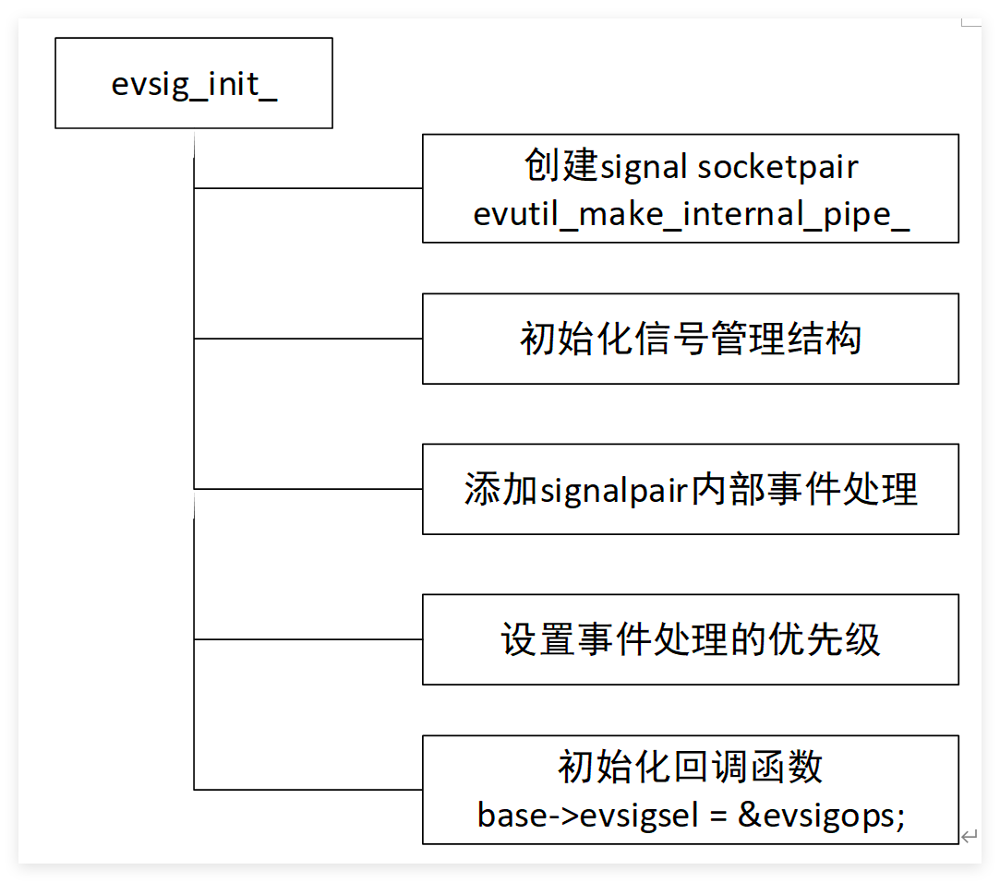
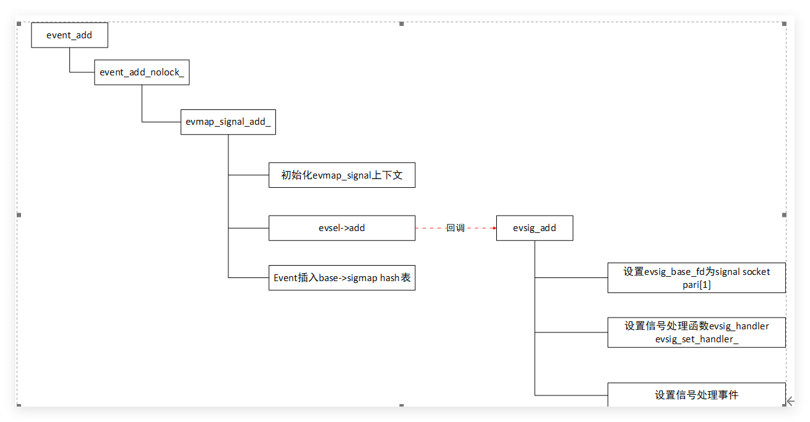
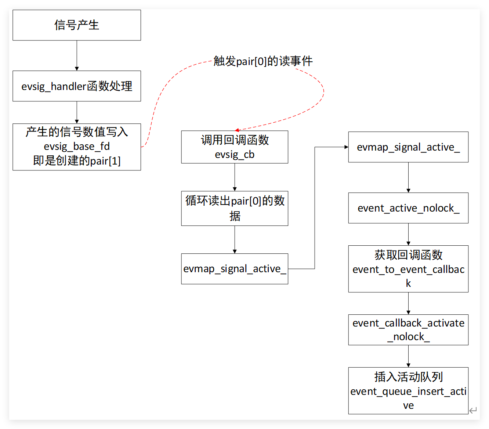

信号事件主要通过`struct event_signal_map`和`struct evmap_signal`结构管理

结构体见:[libevent structure](libevent%20structure.md)
# 事件初始化


事件初始化工作在`epoll_init`函数通过`evsig_init_`开始.  其大致流程如下

主要创建socket_pair，监听socket_pair[0]的读事件，设置对应读事件的回调函数为evsig_cb

# 信号事件添加

信号事件的添加主要通过以下宏定义进行操作
```c
/**
   @name evsignal_* macros

   Aliases for working with signal events
 */
/**@{*/
#define evsignal_add(ev, tv)		event_add((ev), (tv))

#define evsignal_assign(ev, b, x, cb, arg)			\
	event_assign((ev), (b), (x), EV_SIGNAL|EV_PERSIST, cb, (arg))
	
#define evsignal_new(b, x, cb, arg)				\
	event_new((b), (x), EV_SIGNAL|EV_PERSIST, (cb), (arg))
	
#define evsignal_del(ev)		    event_del(ev)
#define evsignal_pending(ev, tv)	event_pending((ev), EV_SIGNAL, (tv))
#define evsignal_initialized(ev)	event_initialized(ev)
/**@}*/
```

如上面所示，最后调用的也是event_相关函数。

event_new也是申请一个struct event内存，然后进行初始化，主要携带的标志为`EV_SIGNAL`
主要通过设置信号处理回调函数为evsig_handler;

evsig_handler主要作用是通过socket_pair[1]发送对应的信号number。

然后socket_pair[0]触发读事件，获取出信号number，通过查找base->sigmaphash表，获取信号处理回调函数，进行信号处理。

# 信号事件触发
linux内核检测到信号发生，调用用户注册的回调函数evsig_handler。

最后通过event_process_active函数进行处理。

# 信号事件删除

直接调用event_del释放相应的资源

```c
int event_del(struct event*);
```